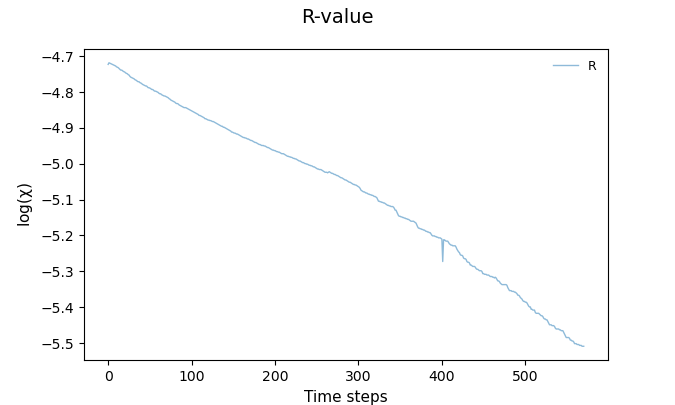
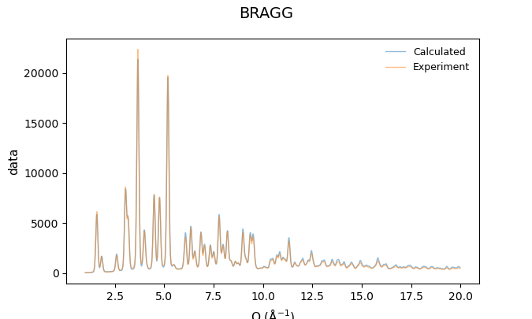
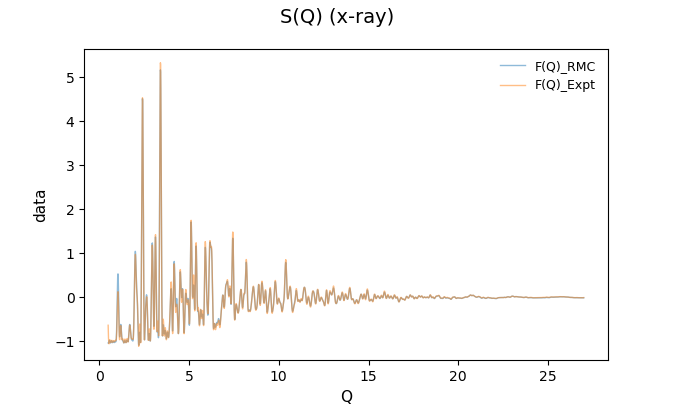
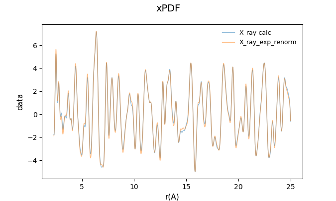
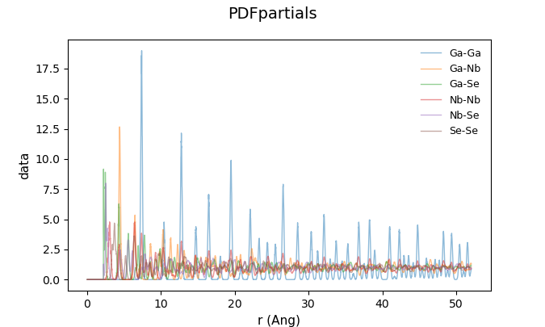
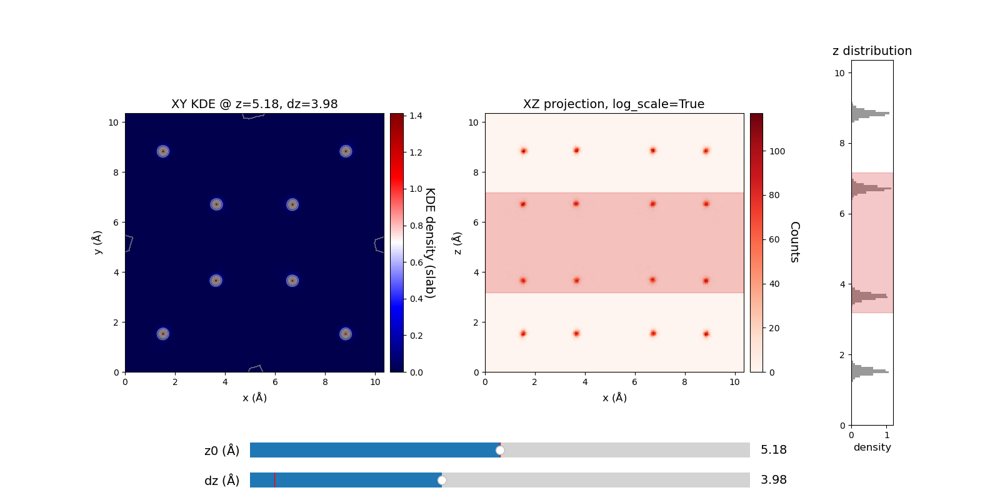
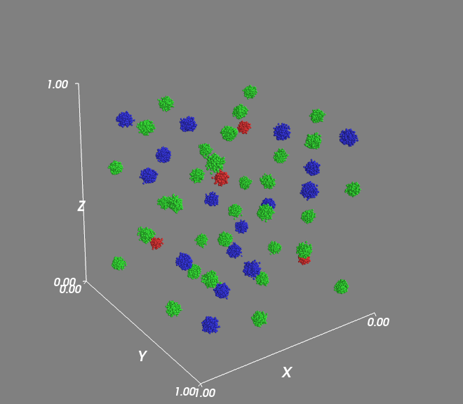

# rmc-toolkits

Post-processing utilities and a small web viewer for RMCProfile outputs. The repo includes:

- CLI plotting scripts for RMCProfile CSV/log outputs.
- A 3D atom-position visualizer for RMC `.rmc6f` + `Frac*.txt` inputs.
- An interactive KDE slice viewer for 3D atomic densities.
- A Flask + React web app to browse output files and render plots in the browser.

## Contents

- `src/RMC_plot.py` plots common RMCProfile outputs (`*_FQ1.csv`, `*_FT_XFQ1.csv`, `*_SQ1.csv`, `*_bragg.csv`, `*PDF*.csv`, and `*.log`).
- `src/RMC_3D.py` renders folded atomic positions in 3D (Mayavi) from `Frac*.txt` and `.rmc6f`.
- `src/RMC_KDE.py` provides interactive KDE slice plots of 3D atomic densities from `Frac*.txt` and `.rmc6f`.
- `src/STOG_plot.py` plots STOG outputs like `scale_ft.gr`, `scale_ft.sq`, and related inputs.
- `web_app/` contains a Flask backend and a React frontend to browse and plot files interactively.
- `data/` includes example RMCProfile outputs you can use for quick testing.

## Quickstart (CLI)

1. Create a Python environment and install dependencies (minimal set shown):

```bash
python -m venv .venv
source .venv/bin/activate
pip install numpy matplotlib scipy seaborn
```

2. Plot RMCProfile outputs from a directory:

```bash
python src/RMC_plot.py --dir data
```

3. Save plots to PNG files instead of showing them:

```bash
python src/RMC_plot.py --dir data --save --no-show
```

## KDE Slice Viewer

`src/RMC_KDE.py` expects a `Frac*.txt` file and a `.rmc6f` file in the working directory. It opens an interactive UI with sliders for the z-slice position and thickness.

```bash
python src/RMC_KDE.py
```

Plot a single element (by symbol) instead of all atoms:

```bash
python src/RMC_KDE.py --el Mn
```

## 3D Visualization

`src/RMC_3D.py` expects a `Frac*.txt` file and a `.rmc6f` file in the working directory. It uses Mayavi for 3D scatter rendering.

```bash
pip install mayavi
python src/RMC_3D.py
```

## Web App

The web app renders plots on the backend and displays them in the frontend. The backend imports `RMC_plot.py` from `src`, so run it with `PYTHONPATH=./src` from the repo root.

1. Backend (Flask):

```bash
python -m venv .venv
source .venv/bin/activate
pip install -r web_app/backend/requirements.txt
PYTHONPATH=./src python web_app/backend/app.py
```

2. Frontend (React + Vite):

```bash
cd web_app/frontend
npm install
npm run dev
```

Then open the Vite dev server URL and use the file explorer to navigate your data directory. The backend runs on port `5000` by default.

## Screenshots
- Check RMC progress (RMC_plot.py)
<div align="center">
  
  
  
</div>
<div align="center">
  
  
</div>
- KDE slice viewer (RMC_KDE.py)
<div align="center">
  
</div>
- 3D atomic positions (RMC_3D.py)
<div align="center">
  
</div>

## Expected File Types

The plotting utilities look for common RMCProfile outputs, including:

- Real-space `G(r)` files: `*_FT_XFQ1.csv`, `*PDF*.csv`
- Reciprocal-space `S(Q)` files: `*_FQ1.csv`, `*_SQ1.csv`
- Bragg: `*_bragg.csv`
- Log files with chi values: `*-*.log`

## Notes

- The scripts assume RMCProfile-style CSV formatting (first row = headers).
- For headless environments, use `--no-show` and `--save` in `RMC_plot.py`.
- `STOG_plot.py` expects a local `stog_input.dat` and STOG output files in the current directory.
- `RMC_KDE.py` and `RMC_3D.py` expect `Frac*.txt` + `.rmc6f` in the working directory.

## Project Status

This is a research tooling repo with lightweight scripts and a simple viewer. If you need new plot types or additional file patterns, feel free to extend `src/RMC_plot.py`.
