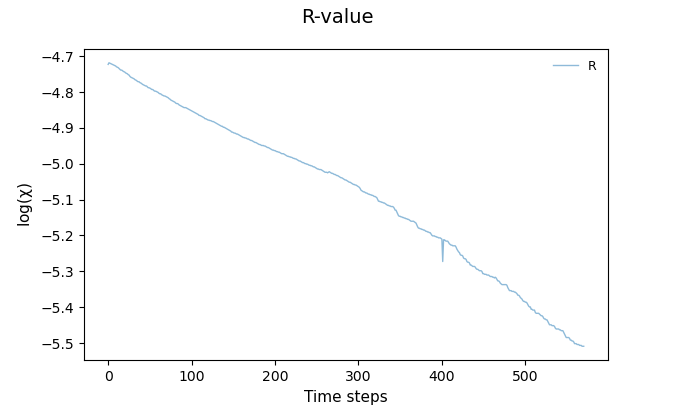
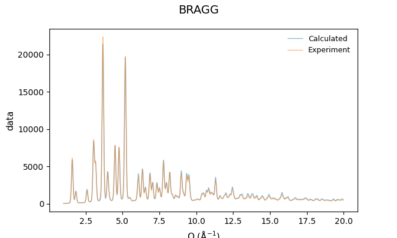
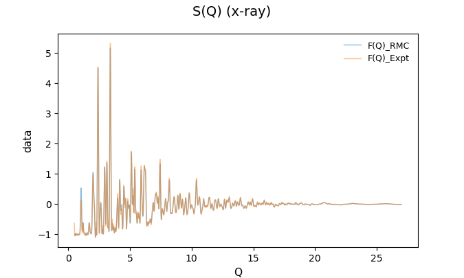
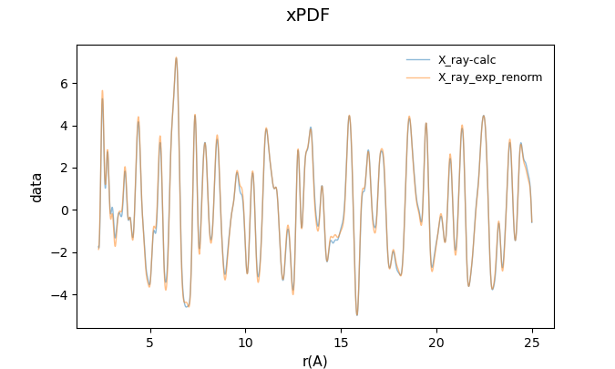
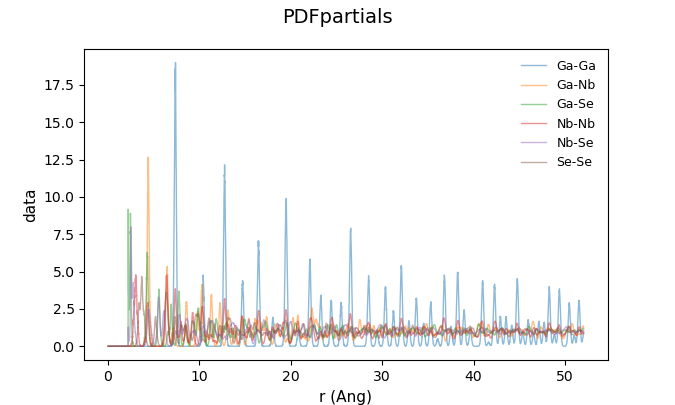
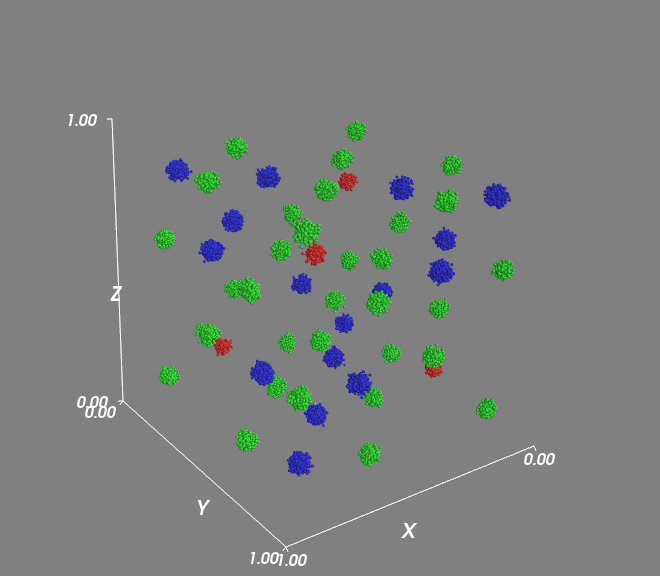
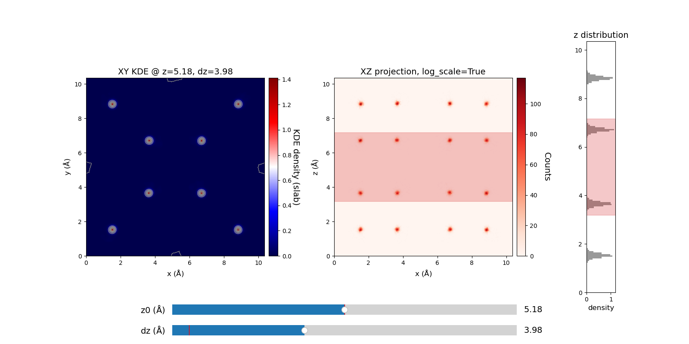

# rmc-toolkits

Post-processing utilities and a small web viewer for RMCProfile outputs. The repo includes:

- CLI plotting scripts for RMCProfile CSV/log outputs.
- A reusable `rmc_toolkits/` package for parsing and plot generation.
- A React dashboard for viewing all detected plots in a run folder.
- A KDE / 3D page for structure-density slices and a Three.js atom model.
- A 3D atom-position visualizer for RMC configuration.
- An interactive KDE slice viewer for 3D atomic densities.

## Contents

- `rmc_toolkits/` contains reusable parsing and plotting functions for app development.
- `src/RMC_plot.py` plots common RMCProfile outputs (`*_FQ1.csv`, `*_FT_XFQ1.csv`, `*_SQ1.csv`, `*_bragg.csv`, `*PDF*.csv`, and `*.log`).
- `src/RMC_3D.py` renders folded atomic positions in 3D (Mayavi) from `Frac*.txt` and `.rmc6f`.
- `src/RMC_KDE.py` provides interactive KDE slice plots of 3D atomic densities from `Frac*.txt` and `.rmc6f`.
- `src/STOG_plot.py` plots STOG outputs like `scale_ft.gr`, `scale_ft.sq`, and related inputs.
- `data/` includes example RMCProfile outputs you can use for quick testing.

## Quickstart (CLI)

1. Create a Python environment and install dependencies (minimal set shown):

```bash
python -m venv .venv
source .venv/bin/activate
pip install numpy matplotlib scipy seaborn
```

2. Plot RMCProfile outputs from a directory:

```bash
python src/RMC_plot.py --dir data
```

3. Save plots to PNG files instead of showing them:

```bash
python src/RMC_plot.py --dir data --save --no-show
```

## KDE Slice Viewer

`src/RMC_KDE.py` expects a `Frac*.txt` file and a `.rmc6f` file in the working directory. It opens an interactive UI with sliders for the z-slice position and thickness.

If you only have an `.rmc6f` file, generate the matching fractional-coordinate text file from Python:

```python
from rmc_toolkits.parsers import write_frac_from_rmc6f

write_frac_from_rmc6f("data/GNSe.rmc6f", overwrite=True)
```

```bash
python src/RMC_KDE.py
```

Plot a single element (by symbol) instead of all atoms:

```bash
python src/RMC_KDE.py --el Mn
```

## 3D Visualization

`src/RMC_3D.py` expects a `Frac*.txt` file and a `.rmc6f` file in the working directory. It uses Mayavi for 3D scatter rendering.

```bash
pip install mayavi
python src/RMC_3D.py
```

## Screenshots
- RMC monitor (RMC_plot.py)
<div align="center">
  
  
  
</div>
<div align="center">
  
  
</div>

- 3D atomic positions, reduced to unit cell (RMC_3D.py)
<div align="center">
  
</div>

- KDE slice viewer (RMC_KDE.py)
<div align="center">
  
</div>


## Expected File Types

The plotting utilities look for common RMCProfile outputs, including:

- Real-space `G(r)` files: `*_FT_XFQ1.csv`, `*PDF*.csv`
- Reciprocal-space `S(Q)` files: `*_FQ1.csv`, `*_SQ1.csv`
- Bragg: `*_bragg.csv`
- Log files with chi values: `*-*.log`

## Notes

- The scripts assume RMCProfile-style CSV formatting (first row = headers).
- For headless environments, use `--no-show` and `--save` in `RMC_plot.py`.
- `STOG_plot.py` expects a local `stog_input.dat` and STOG output files in the current directory.
- `RMC_KDE.py` and `RMC_3D.py` expect `Frac*.txt` + `.rmc6f` in the working directory.

## Project Status

This is a research tooling repo evolving into a local-first analysis app. See `docs/HANDOFF.md` for the current implementation hand-off and `docs/ROADMAP.md` for the development roadmap.
