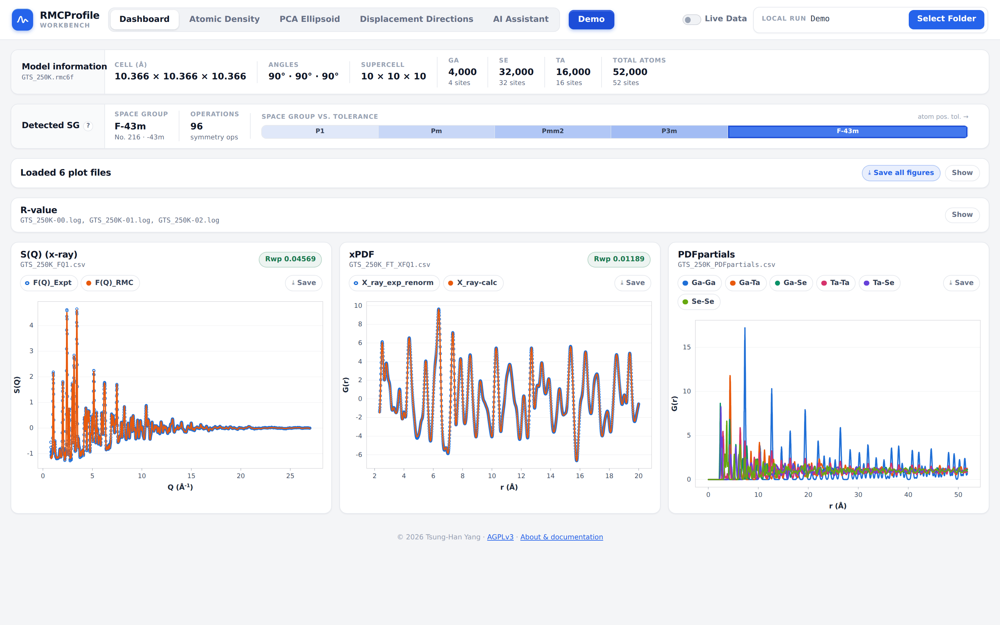
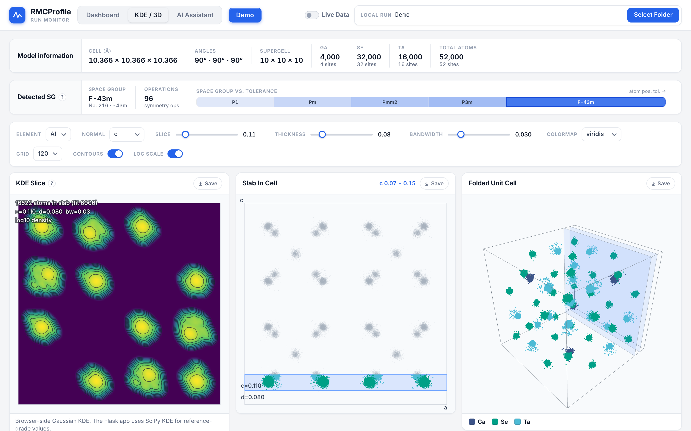
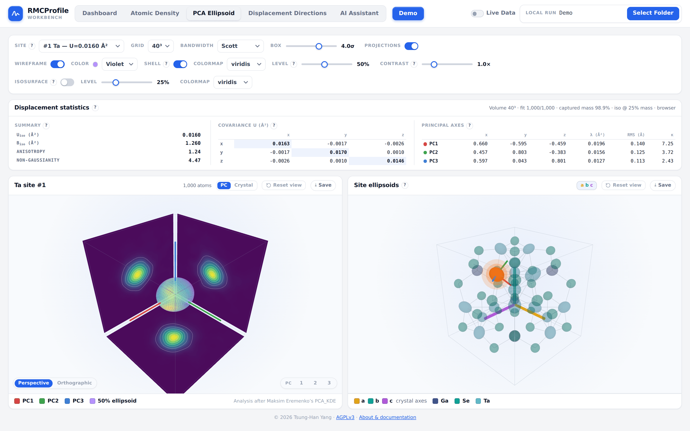
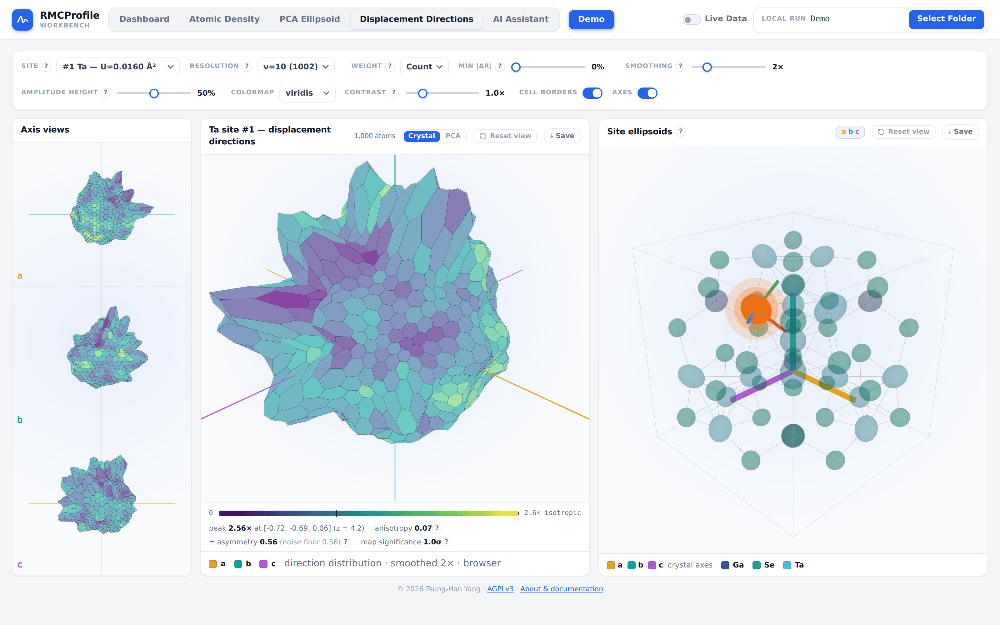
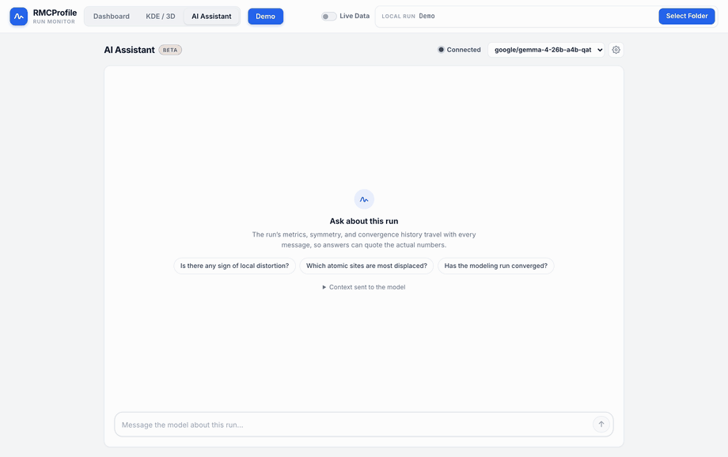

# RMCProfile Workbench

[](https://github.com/drthyang/rmc-toolkits/actions/workflows/tests.yml)
[](LICENSE)

A **browser-first dashboard** for inspecting **RMCProfile** modeling run folders. Open the hosted
app, select a run directory, and review plots, model information, atomic-density KDE slices, PCA
thermal ellipsoids, displacement-direction maps, symmetry, and 3D structure views without
installing anything.

### ▶️ Open the app — [drthyang.github.io/rmc-toolkits](https://drthyang.github.io/rmc-toolkits/)

1. Visit the link above.
2. Click **Select Folder** and choose your RMCProfile run directory — or press **Demo** for a
   bundled example run.
3. Everything renders in your browser.

🔒 **Your raw run files never leave your device.** They are read and rendered entirely in your
browser and are never uploaded to rmc-toolkits or any project server. (Your browser's picker may
say “Upload”, but nothing is sent anywhere.)[^cloud-llm-privacy]

⚡ **Live monitoring** auto-refreshes charts as new files are written, in Chromium browsers (Chrome,
Edge, Arc, Opera).

📖 **New here?** Start with [QuickStart.md](QuickStart.md). Everything else — local/self-hosted
setup, backend API, file formats — lives in [docs/REFERENCE.md](docs/REFERENCE.md).

## Features

- **Run dashboard** — auto-detects RMCProfile outputs (PDF/G(r), S(Q), Bragg profiles, partials,
  EXAFS Q/R CSVs, R-value logs) and renders interactive charts with hover readouts, drag-to-zoom,
  and PNG/SVG/`.zip` export.
- **Live Data** — charts auto-refresh while your run writes new files: client-side in Chromium
  browsers, or server-side through the optional Flask backend.
- **Atomic Density** — KDE density slices (WebGPU with automatic CPU fallback), a draggable
  slab-in-cell projection, and a Three.js folded unit-cell view of `.rmc6f` structures.
- **PCA Ellipsoid** — per-site thermal ellipsoids from the RMC displacement clouds: anisotropic
  displacement tensor, 3D KDE isosurface with wall projections, non-Gaussianity readouts, and each
  principal axis's angles to a/b/c with the crystallographic direction [u v w] it runs along.
  Follows Maksim Eremenko's
  [PCA_KDE utilities](https://github.com/MaximEremenko/Utilities/tree/main/RMCProfileUtilities/PCA_KDE)
  (independent reimplementation).
- **Displacement Directions** — the direction-space counterpart to the ellipsoid: displacement
  directions binned in solid angle on a hex-tiled sphere reveal discrete hop directions and ±u
  asymmetry that the U tensor cannot see.
- **Symmetry analysis** — a client-side, FINDSYM-like panel reports the detected space group and
  how it changes with tolerance. Screw axes and glide planes are read from each operation's
  translation part, so non-symmorphic groups are named as themselves (Pnma, I4/mcm, Fd-3m),
  resolved against all 230 groups with Wyckoff letters per orbit. Unlike FINDSYM it takes the cell
  as given — no cell search, origin shift, or idealized structure.
- **AI Assistant (beta)** — chat about the loaded run with a local LLM (Ollama, LM Studio) or an
  opt-in cloud model (OpenAI, Gemini). Only compact run context is sent, never raw
  files.[^cloud-llm-privacy] Setup:
  [`web_app/frontend/src/llm/README.md`](web_app/frontend/src/llm/README.md).
- **Python package (`rmc_toolkits/`)** — the same parsing, plotting, KDE, PCA-ellipsoid, and
  displacement-direction analyses as a reusable library, plus `.rmc6f` conversion helpers.

[^cloud-llm-privacy]: If you opt into a cloud LLM, the compact summarized run context used for
    assistant responses is sent directly to the cloud LLM server you selected. Raw run files are not
    uploaded to rmc-toolkits.

## Screenshots

| Run dashboard | Atomic density (KDE / slab / 3D) |
| --- | --- |
|  |  |

| PCA ellipsoid (thermal ellipsoids) | Displacement directions |
| --- | --- |
|  |  |

### AI Assistant

Ask about the loaded run in plain language. The run's metrics, symmetry, and convergence history
travel with every message, so answers quote the actual numbers — and reasoning models stream their
chain of thought in a collapsible *Thinking* panel. Below, a local model (Ollama) summarizes the
bundled demo run as a table, with LaTeX math such as Rwp and χ² rendered inline.



## The Math Under the Hood

Nothing here is a black box. [docs/ALGORITHMS.md](docs/ALGORITHMS.md) is a code-anchored account of
**every operation each page performs on your data** — each step naming the file and function that
runs it, with the approximations stated rather than buried. The signature equations, one per
analysis page:

**Fit residual** — the chip on each dashboard chart, computed from a file's 2nd and 3rd columns:

$$R=\sqrt{\frac{\sum_i\bigl(y^{(3)}_i-y^{(2)}_i\bigr)^2}{\sum_i\bigl(y^{(2)}_i\bigr)^2}}$$

Labelled "Rwp", but **unweighted** — and since RMCProfile writes these CSVs as
`(x, calculated, experimental)`, the denominator is the *calculated* curve. It is therefore not the
crystallographic $R_\mathrm{wp}$; recompute from the columns before quoting it in a paper. Points
where either column is non-finite are skipped, and if none remain — or the denominator is zero —
the chip reads **—** instead of a number.
→ [derivation](docs/algorithms/run-dashboard.md#step-5--compute-the-numbers)

**Atomic density** — a 2-D Gaussian KDE over the supercell folded into one unit cell, with
bandwidth $\mathbf H$ scaled from the sample covariance $\mathbf C$ (SciPy's convention):

$$\rho(\mathbf p)=\frac{\kappa}{n}\sum_{i=1}^{n}\frac{\exp\!\left[-\tfrac12(\mathbf p-\mathbf p_i)^{\!\top}\mathbf H^{-1}(\mathbf p-\mathbf p_i)\right]}{2\pi\sqrt{\det\mathbf H}},\qquad \mathbf H=f^2\mathbf C$$

$\kappa$ corrects for the neighbour images tiled around the cell to restore periodicity.
→ [derivation](docs/algorithms/structure.md#step-6--the-gaussian-kernel-bandwidth-matrix-and-normalization)

**Thermal ellipsoids** — the anisotropic displacement tensor is the displacement covariance, and the
drawn surface is its $\chi^2$ probability ellipsoid:

$$U_{ab}=\frac{1}{n-1}\sum_n u_{na}u_{nb},\qquad\text{semi-axes } k(p)\,\sigma_a,\quad k(p)=\sqrt{F^{-1}_{\chi^2_3}(p)}$$

The crystallographic 50 % convention is $k=1.5382$. $U$ is Cartesian — there is no conversion to
$U_\mathrm{cif}$ or $\beta_{ij}$ anywhere.
→ [derivation](docs/algorithms/pca-ellipsoid.md#step-3--covariance-and-eigen-decomposition)

**Displacement directions** — amplitude discarded, directions binned in solid angle on a Goldberg
sphere of $10\nu^2+2$ cells, each count divided by that cell's *exact* solid angle $\Omega_m$:

$$\mathbf u_i=\frac{\Delta\mathbf r_i}{\lVert\Delta\mathbf r_i\rVert},\qquad \rho_m=\frac{M_m}{\bigl(\sum_{m'}M_{m'}\bigr)\Omega_m},\qquad \mathcal E_m=4\pi\rho_m$$

The plotted enhancement $\mathcal E$ is dimensionless: 1 is isotropic, and 1.8 means "this direction
is 1.8× more likely than chance".
→ [derivation](docs/algorithms/displacement-directions.md#step-6--the-histogram)

The Python package is the reference implementation; the browser workers are hand-written ports of
it. Which port is parity-tested against Python goldens — and which is only pinned to its own
in-language reference — is stated per engine, along with the measured tolerances.

## Run It Locally (optional)

The hosted app needs no install. Run the Flask backend when you want server-side file browsing,
`.rmc6f` conversion, reference-grade SciPy KDE, or to self-host on a network:

```bash
python3 -m venv .venv && source .venv/bin/activate
pip install -r web_app/backend/requirements.txt && pip install -e .
(cd web_app/frontend && npm install && npm run build)   # Node 20.19+ or 22.12+
python web_app/backend/app.py                           # http://127.0.0.1:5000/
```

Ports, data roots, dev servers, Docker/GitHub Pages deployment, the backend API, and supported
file patterns are covered in [docs/REFERENCE.md](docs/REFERENCE.md).

## Python Package

```python
from rmc_toolkits import kde_slice, load_unit_cell_positions, make_plot, plot_to_png

demo = "web_app/frontend/public/demo"  # bundled GaTa4Se8 250 K example run

positions = load_unit_cell_positions(f"{demo}/GTS_250K.rmc6f", element="Ga")
density = kde_slice(
    positions.positions,
    z_center=0.5 * positions.cell_lengths[2],
    dz=0.08 * positions.cell_lengths[2],
    xlim=(0.0, float(positions.cell_lengths[0])),
    ylim=(0.0, float(positions.cell_lengths[1])),
)
png_bytes = plot_to_png(make_plot(f"{demo}/GTS_250K_FQ1.csv"))
```

Full usage, parser helpers, and the legacy CLI scripts:
[docs/REFERENCE.md](docs/REFERENCE.md#python-package-usage).

## Documentation

- [QuickStart.md](QuickStart.md) — guided tour of the hosted app, including AI-assistant setup.
- [docs/ALGORITHMS.md](docs/ALGORITHMS.md) — **the math**: a code-anchored account of every
  operation each page performs on your data, so you can audit how a plot, density map, symmetry
  label, scaled dataset, or direction map was produced — including the approximations.
- [docs/REFERENCE.md](docs/REFERENCE.md) — repository layout, setup, self-hosting, backend API,
  supported file patterns, package usage, legacy CLI scripts, tests.
- [docs/ROADMAP.md](docs/ROADMAP.md) · [docs/CHANGELOG.md](docs/CHANGELOG.md) — plans and history.
- [AGENTS.md](AGENTS.md) — architecture notes and contributor onboarding.

## License

Released under the [GNU Affero General Public License v3.0](LICENSE) © 2026 Tsung-Han Yang.

The AGPL is a strong copyleft license: you may use, study, modify, and redistribute this
software, but derivative works must also be released under the AGPLv3. Notably, if you run a
modified version as a **network service**, you must offer its complete source code to the users
of that service (AGPL §13). If you use rmc-toolkits in published research, please cite it.

*This project is personal work, developed and maintained in my personal capacity.*
