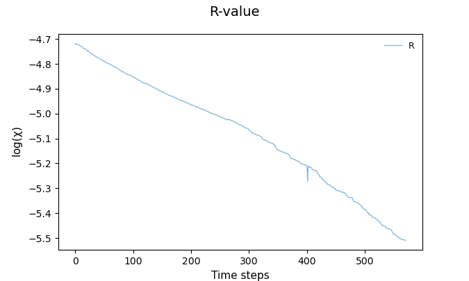
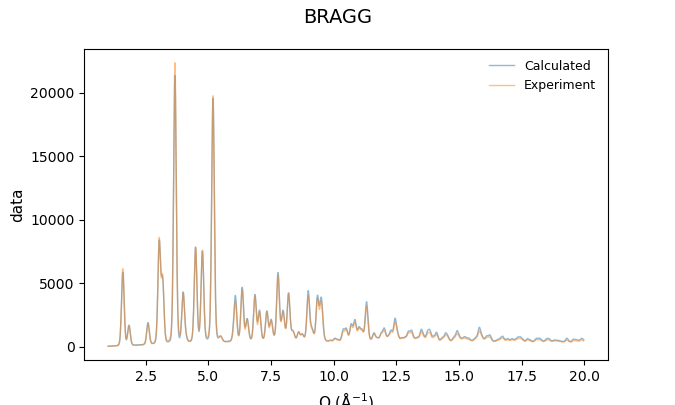
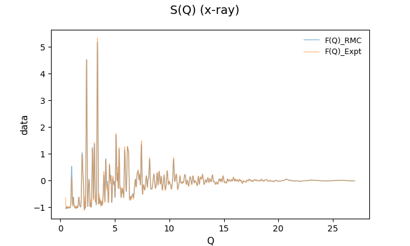
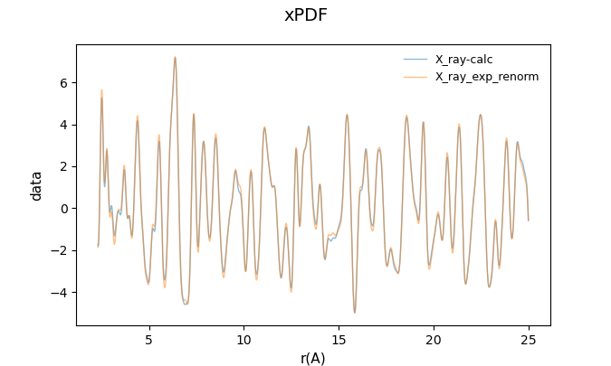
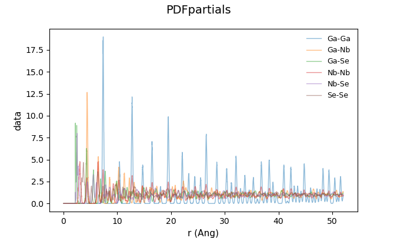
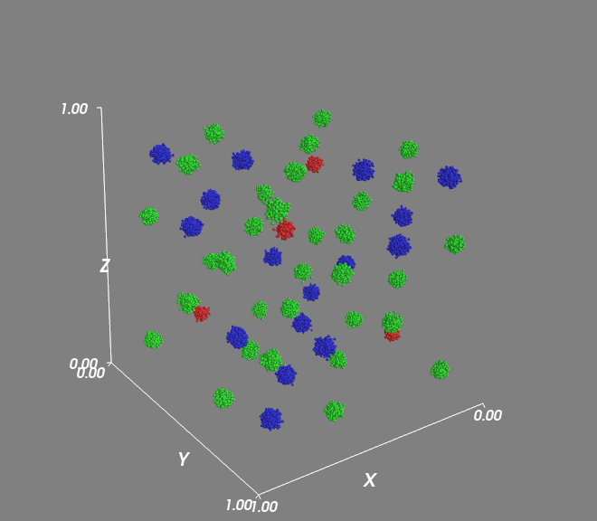
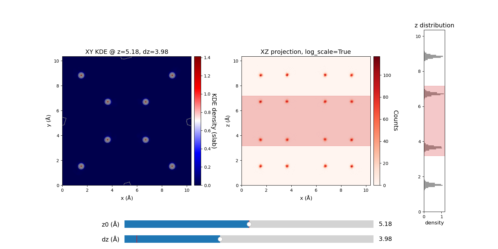

# rmc-toolkits

Post-processing utilities and a local-first web app for **RMCProfile** and **STOG** outputs.

The project started as a set of CLI plotting scripts and is evolving into a browser-based
analysis workspace. It now has three layers:

- **`rmc_toolkits/`** — a reusable Python package for parsing RMC outputs, generating plots,
  and computing KDE density slices. New development should depend on this package.
- **`web_app/`** — a Flask backend + React (Vite) frontend that turns a run directory into an
  interactive dashboard and a KDE / 3D structure viewer.
- **`src/`** — the original standalone CLI scripts, kept for familiar research workflows.

> See [`docs/HANDOFF.md`](docs/HANDOFF.md) for the implementation hand-off and
> [`docs/ROADMAP.md`](docs/ROADMAP.md) for where this is headed.

## Features

- **Run dashboard** — renders every detected plot in a run folder (R-value history, S(Q),
  G(r), Bragg, partials) as interactive browser-native SVG charts with hover readouts, legend
  toggles, and drag-to-zoom.
- **Native folder picker** — choose a data directory from the system file browser, with automatic
  detection of each file's plot kind after loading.
- **KDE / 3D page** — a real server-side SciPy `gaussian_kde` density slice with bandwidth,
  colormap, grid-resolution, contour, and log-scale controls; an x–z slab-in-cell projection;
  and a Three.js folded-unit-cell atom viewer with orbit/pan/zoom.
- **Light-mode workspace** with a native folder picker for choosing a data root.
- **`.rmc6f` → `Frac_coord_<stem>.txt`** conversion from the file browser or the API.

## Repository layout

| Path | Purpose |
| --- | --- |
| `rmc_toolkits/parsers.py` | Parse RMC CSV / log / STOG / `.rmc6f` / `Frac*.txt`; structure loading; `.rmc6f` → `Frac*.txt`. |
| `rmc_toolkits/plots.py` | Plot-kind detection, figure generation, metric calculation, PNG serialization. |
| `rmc_toolkits/kde.py` | Server-side KDE slice computation (unit-cell folding + `gaussian_kde` + contours). |
| `web_app/backend/app.py` | Flask API server. |
| `web_app/frontend/` | React + Vite single-page app. |
| `src/RMC_plot.py` | CLI plotter for RMCProfile CSV/log outputs. |
| `src/RMC_KDE.py` | Interactive (matplotlib) KDE slice viewer. |
| `src/RMC_3D.py` | Mayavi 3D atom-position viewer. |
| `src/STOG_plot.py` | STOG output plotter. |
| `data/` | Example RMCProfile outputs (the `GNSe` sample) for quick testing. |
| `tests/` | `unittest` suite for the package and backend API. |

## Running the web app

The app has two processes: a Flask backend and a Vite frontend dev server.

### Prerequisites

- **Python 3.9+** — use a clean virtual environment. (A system Anaconda install with a broken
  numpy will not work; a dedicated `venv` is the supported path.)
- **Node.js 20.19+** (or 22.12+) for the Vite 7 / React 19 frontend.

### 1. Backend

```bash
python3 -m venv .venv
source .venv/bin/activate
pip install numpy scipy flask flask-cors matplotlib contourpy

python web_app/backend/app.py
```

The backend listens on **`http://localhost:5000`** by default.

> **macOS note:** port 5000 is taken by the AirPlay Receiver (Control Center). Either disable
> *System Settings → General → AirDrop & Handoff → AirPlay Receiver*, or run the backend on
> another port:
>
> ```bash
> RMC_TOOLKITS_PORT=5050 python web_app/backend/app.py
> ```

**Data root.** By default the backend may only browse files under the project root. Point it at
your own RMC data directory with:

```bash
RMC_TOOLKITS_DATA_ROOT=/absolute/path/to/rmc/data python web_app/backend/app.py
```

### 2. Frontend

```bash
cd web_app/frontend
npm install
npm run dev
```

The frontend talks to `http://localhost:5000` by default. If you changed the backend port (e.g.
to 5050), point the frontend at it via `VITE_API_BASE_URL` — for example create
`web_app/frontend/.env.local`:

```bash
VITE_API_BASE_URL=http://localhost:5050
```

or pass it inline:

```bash
VITE_API_BASE_URL=http://localhost:5050 npm run dev
```

### 3. Open the app

Vite serves the UI at **`http://localhost:5173/`**. Use the data-path field in the header to
browse a run folder and switch between the **Dashboard** and **KDE / 3D** views.

## Backend API

All endpoints are under `/api`. Paths are resolved relative to the configured data root and are
rejected if they escape it.

| Method & path | Description |
| --- | --- |
| `GET /api/health` | Service status and the active data root. |
| `GET /api/files?path=` | List a directory; each entry includes its detected `plotKind`. |
| `POST /api/dialog/folder` | Open a native folder picker and register the choice as an allowed data root. |
| `GET /api/plot?path=` | Render a single file's plot as a PNG. |
| `GET /api/plot/metadata?path=` | Plot kind, title, and numeric metrics (e.g. `rwp`). |
| `GET /api/plot/data?path=` | Parsed plot series + normalized scientific labels for browser-native rendering. |
| `POST /api/convert/frac` | Generate `Frac_coord_<stem>.txt` from a `.rmc6f` file. Body: `{ path, outputPath?, overwrite? }`. |
| `GET /api/structure?dir=&maxPoints=` | Sampled folded atom positions, element counts, and lattice metadata. |
| `GET /api/kde/slice?...` | Real SciPy `gaussian_kde` density grid + contour polylines for a z-slab. |

## Using the package

```python
from rmc_toolkits.parsers import write_frac_from_rmc6f, read_structure

# Generate the fractional-coordinate text file from an .rmc6f
write_frac_from_rmc6f("data/GNSe.rmc6f", overwrite=True)

# Load a folded unit cell (Frac*.txt + .rmc6f must be in the directory)
structure = read_structure("data")
print(structure.lattice_vectors, len(structure.atom_types))
```

## CLI scripts

The original scripts remain available for quick, script-first workflows.

```bash
pip install numpy matplotlib scipy seaborn

# Plot all RMCProfile outputs in a directory
python src/RMC_plot.py --dir data

# Save plots to PNG instead of showing them (headless-friendly)
python src/RMC_plot.py --dir data --save --no-show

# Interactive KDE slice viewer (expects Frac*.txt + .rmc6f in the working dir)
python src/RMC_KDE.py            # all atoms
python src/RMC_KDE.py --el Mn    # single element by symbol

# 3D atomic positions (requires Mayavi)
pip install mayavi
python src/RMC_3D.py
```

## Tests

The package and backend API have a standard-library `unittest` suite that runs against the
sample files in `data/`:

```bash
MPLCONFIGDIR=/tmp/rmc_toolkits_matplotlib python -m unittest discover -s tests
```

## Expected file types

The plotting utilities look for common RMCProfile outputs:

- Real-space `G(r)`: `*_FT_XFQ1.csv`, `*PDF*.csv`
- Reciprocal-space `S(Q)`: `*_FQ1.csv`, `*_SQ1.csv`
- Bragg: `*_bragg.csv`
- Log files with chi values: `*-*.log`
- Structure: `*.rmc6f`, `Frac*.txt`

Notes:

- Scripts assume RMCProfile-style CSV formatting (first row = headers).
- For headless environments, use `--no-show` and `--save` with `RMC_plot.py`.
- `STOG_plot.py` expects a local `stog_input.dat` and STOG output files in the current directory.
- `RMC_KDE.py` and `RMC_3D.py` expect `Frac*.txt` + `.rmc6f` in the working directory.

## Screenshots

CLI tool output (`RMC_plot.py`):

<div align="center">
  
</div>
<!-- <div align="center">
  
  
  
</div>
<div align="center">
  
  
</div> -->

3D atomic positions reduced to the unit cell (`RMC_3D.py`):

<div align="center">
  
</div>

KDE slice viewer (`RMC_KDE.py`):

<div align="center">
  
</div>

## Project status

This is a research tooling repo growing into a local-first analysis app. The reusable package
layer and the interactive web viewer are in place; current focus is broadening backend API
coverage, improving the dashboard UI polish, and expanding the KDE/structure tooling. See [`docs/HANDOFF.md`](docs/HANDOFF.md) and
[`docs/ROADMAP.md`](docs/ROADMAP.md) for details.
