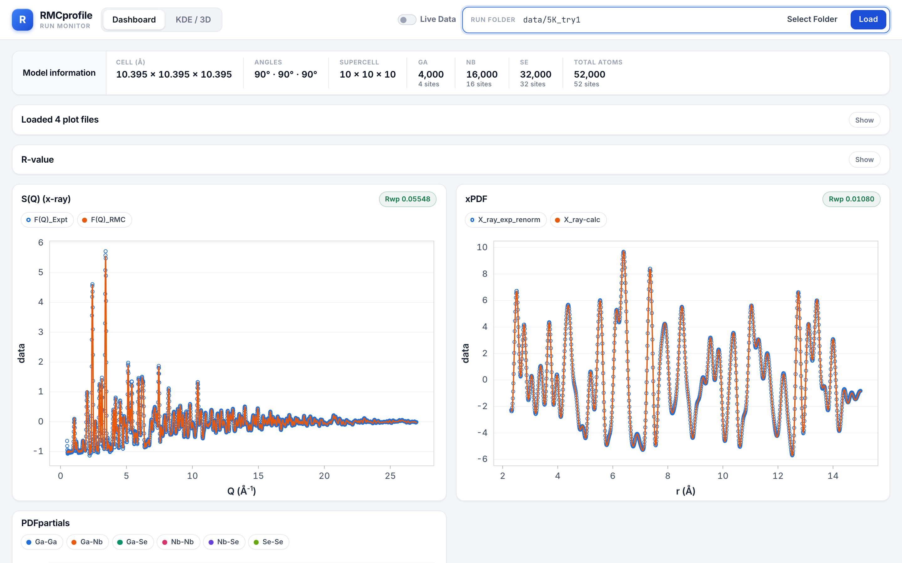
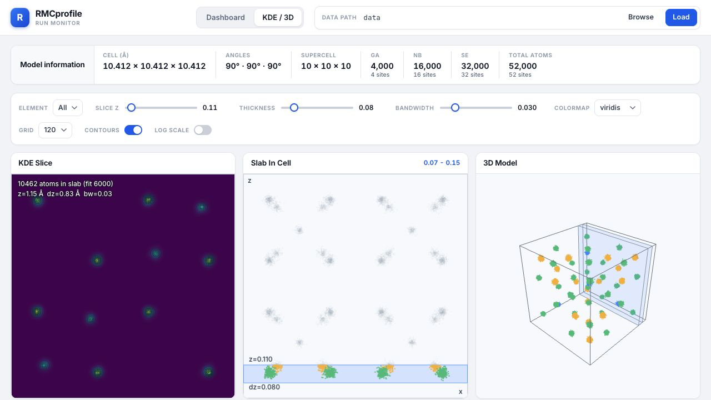

# rmc-toolkits

Post-processing utilities and a local-first dashboard for **RMCProfile** and **STOG** outputs.

Launch the hosted RMCprofile Run Monitor dashboard:
[https://drthyang.github.io/rmc-toolkits/](https://drthyang.github.io/rmc-toolkits/)

For the shortest setup path, see [QuickStart.md](QuickStart.md).

`rmc-toolkits` now has two active layers:

- **Python package (`rmc_toolkits/`)** for parsing RMC/STOG outputs, building plots, converting
  `.rmc6f` files, loading folded structures, and computing SciPy KDE slices.
- **Web app (`web_app/`)** with a Flask API and React/Vite frontend for loading a run directory,
  inspecting interactive plots, converting structures, and exploring KDE/3D views.

The original standalone research scripts are still available in `src/` for familiar command-line
workflows.

## Features

- **Run dashboard**: detects supported RMCProfile outputs in a folder and renders browser-native
  SVG charts with hover readouts, legend toggles, and drag-to-zoom.
- **Loaded-file controls**: lists detected plot files in the dashboard and lets users hide or show
  individual charts from the loaded-file badges.
- **Local data loading**: accepts a run-folder path, uses a native folder picker in local desktop
  sessions, and supports browser-only folder selection on GitHub Pages.
- **Live Data monitoring**: in the local Flask app, watches the selected folder and refreshes charts
  when supported files change.
- **Plot API**: returns plot metadata, PNG renderings, and parsed data series for R-value logs,
  S(Q), G(r), Bragg, PDF, PDF partials, and basic STOG outputs.
- **Structure conversion**: writes `Frac_coord_<stem>.txt` from an `<stem>.rmc6f` file (thermal_ellipsoid).
- **Structure viewer data**: samples folded unit-cell atom positions while preserving reference
  number/site coverage for larger structures.
- **KDE slices**: computes server-side `scipy.stats.gaussian_kde` XY density grids for z-slabs,
  with element filtering, bandwidth, grid size, contour, and log-scale options.
- **3D frontend view**: uses Three.js orbit/pan/zoom controls, a publication-style atom
  palette, and a slab overlay synchronized to the KDE controls.

## Screenshots

RMCProfile run dashboard:



KDE slice, slab view, and 3D model:



## Repository Layout

| Path | Purpose |
| --- | --- |
| `rmc_toolkits/parsers.py` | RMC CSV/log/STOG parsing, `.rmc6f` metadata, atom iteration, `Frac*.txt` conversion, folded structure loading. |
| `rmc_toolkits/plots.py` | Plot-kind detection, matplotlib figure generation, Rwp/final chi metrics, PNG serialization. |
| `rmc_toolkits/kde.py` | Unit-cell position loading and server-side KDE slice computation with contour extraction. |
| `web_app/backend/app.py` | Flask API server with data-root guarding. |
| `web_app/frontend/` | React + Vite single-page app. |
| `src/` | Original standalone CLI/desktop scripts. |
| `data/` | GNSe sample files for quick testing. |
| `tests/` | Standard-library `unittest` suite for the package and backend API. |
| `docs/` | Handoff notes and roadmap. |

## Setup

Create a Python environment from the project root:

```bash
python3 -m venv .venv
source .venv/bin/activate
pip install -r web_app/backend/requirements.txt
```

The frontend requires Node.js compatible with Vite 7, such as Node `20.19+` or `22.12+`.

```bash
cd web_app/frontend
npm install
```

## Running The Web App

For normal local use, build the frontend once and serve it from Flask:

```bash
cd web_app/frontend
npm install
npm run build
cd ../..
```

Start the local app:

```bash
source .venv/bin/activate
python web_app/backend/app.py
```

Open `http://127.0.0.1:5000/`. On macOS, port 5000 can be occupied by
AirPlay Receiver; use another port if needed:

```bash
RMC_TOOLKITS_PORT=5050 python web_app/backend/app.py
```

By default, the backend only serves paths under the repository root. To browse another data root:

```bash
RMC_TOOLKITS_DATA_ROOT=/absolute/path/to/rmc/data python web_app/backend/app.py
```

Use `Select Folder` to choose a run folder. Turn on `Live Data` when you want the local app to
monitor that folder and refresh charts after files are updated.

For frontend development, start Vite in a second shell:

```bash
cd web_app/frontend
npm run dev
```

Open `http://localhost:5173/`. If the backend is not on port 5000, point the frontend at it:

```bash
VITE_API_BASE_URL=http://localhost:5050 npm run dev
```

To test the production build locally:

```bash
VITE_API_BASE_URL=http://localhost:5050 npm run build
npm run preview -- --host 127.0.0.1 --port 5174
```

## Hosting The Dashboard

There are two supported hosting modes:

- **GitHub Pages static dashboard**: easiest public link. Users select a local run folder in the
  browser, and the dashboard parses supported plot files on their machine. This mode does not upload
  data and does not require a Python server. Static mode also renders uploaded `.rmc6f` structures
  with a browser-side Gaussian KDE worker and 3D model view. Live Data monitoring is available in
  this mode in Chromium browsers (Chrome, Edge, Arc, Opera) via the File System Access API; Safari
  and Firefox can still load a folder once for a static view.
- **Flask web service**: full-featured deployment with server-side file browsing, structure
  sampling, conversion, SciPy KDE computation, and Live Data folder monitoring.

### GitHub Pages Static Dashboard

The repository includes a GitHub Actions workflow at `.github/workflows/pages.yml`. After GitHub
Pages is enabled for Actions deployments, pushes to `main` build `web_app/frontend` with
`VITE_STATIC_MODE=true` and publish the static dashboard.

To test the static build locally:

```bash
cd web_app/frontend
VITE_STATIC_MODE=true VITE_BASE_PATH=/ npm run build
npm run preview
```

Open the preview URL and choose a local run folder. The static dashboard supports local plot parsing
for RMCProfile CSV/log files and basic STOG outputs, plus `.rmc6f` model summaries, slab controls,
a browser-side Gaussian KDE slice, contours, and a Three.js 3D model view. The Flask service still
provides the server-side SciPy KDE path for reference-grade density values.

### Flask Web Service

The included `Dockerfile` builds the React dashboard and serves it from the Flask/Gunicorn backend:

```bash
docker build -t rmc-toolkits-dashboard .
docker run --rm -p 5000:5000 rmc-toolkits-dashboard
```

Open `http://localhost:5000/` to test the production-style build.

For a public deployment, create a Docker-backed web service on a host such as Render, Fly.io,
Railway, or a VPS. Use this repository as the build source and set the service port to the
provider's `PORT` environment variable; the container already honors `PORT` and falls back to
`5000`.

By default, the hosted dashboard browses the files copied into the image, including the sample
`data/` directory. For a real lab deployment, mount or copy your run folders into the container and
set:

```bash
RMC_TOOLKITS_DATA_ROOT=/absolute/path/inside/container
```

The native folder picker is meant for local desktop use and is not useful on a remote server.

## Python Package Usage

Top-level imports expose the current package API:

```python
from rmc_toolkits import (
    detect_plot_kind,
    kde_slice,
    load_unit_cell_positions,
    make_plot,
    plot_to_png,
    read_structure,
    write_frac_from_rmc6f,
)

print(detect_plot_kind("data/GNSe_FQ1.csv"))

frac_path = write_frac_from_rmc6f("data/GNSe.rmc6f", overwrite=True)
structure = read_structure("data")

positions = load_unit_cell_positions("data/GNSe.rmc6f", element="Ga")
payload = kde_slice(
    positions.positions,
    z_center=0.5 * positions.cell_lengths[2],
    dz=0.08 * positions.cell_lengths[2],
    xlim=(0.0, float(positions.cell_lengths[0])),
    ylim=(0.0, float(positions.cell_lengths[1])),
)

plot = make_plot("data/GNSe_FQ1.csv")
png_bytes = plot_to_png(plot)
```

Useful lower-level parser helpers are also exported, including `read_rmc_csv`, `read_chi`,
`read_stog`, `read_atom_indices`, `read_cell_vectors`, `iter_rmc6f_atoms`, `frac_lines_from_rmc6f`,
and `rwp`.

## Backend API

All endpoints are under `/api`. Relative paths resolve under `RMC_TOOLKITS_DATA_ROOT`; absolute
paths are rejected unless they are inside the configured root or a folder selected through the
native folder picker.

| Method & path | Description |
| --- | --- |
| `GET /api/health` | Service status and active data root. |
| `GET /api/files?dir=data` | Directory listing with detected `plotKind` values. |
| `POST /api/dialog/folder` | Open a native folder picker and register the selected folder as an allowed root. |
| `GET /api/plot?path=data/GNSe_FQ1.csv` | Render one supported file as a PNG. |
| `GET /api/plot/metadata?path=...` | Plot kind, title, and metrics such as `rwp` or `final_chi_r`. |
| `GET /api/plot/data?path=...` | Parsed plot series and normalized scientific axis labels for SVG rendering. |
| `POST /api/convert/frac` | Convert `.rmc6f` to `Frac_coord_<stem>.txt`; JSON body accepts `path`, optional `outputPath`, and `overwrite`. |
| `GET /api/structure?dir=data&maxPoints=12000` | Sampled folded atom positions, element counts, atom-index metadata, supercell, and lattice vectors. |
| `GET /api/kde/slice?dir=data&element=Ga&z=0.5&dz=0.08` | KDE density grid, contour polylines, slab counts, and cell lengths. |

## Supported File Patterns

- Real-space PDF/G(r): `*_FT_XFQ1.csv`, `*PDF*.csv`
- Reciprocal-space S(Q): `*_FQ1.csv`, `*_SQ1.csv`
- Bragg profiles: `*_bragg.csv`
- R-value logs: `*.log`
- Basic STOG outputs: `scale_ft.gr`, `scale_ft.sq`, `scale_ft_rmc.fq`
- Structure files: `*.rmc6f`, `Frac*.txt`

The parsers expect RMCProfile-style CSV files where the first row contains labels and following
rows are numeric.

## CLI Scripts

The older scripts remain useful for quick local workflows:

```bash
pip install numpy matplotlib scipy seaborn

python src/RMC_plot.py --dir data
python src/RMC_plot.py --dir data --save --no-show

python src/RMC_KDE.py
python src/RMC_KDE.py --el Mn

pip install mayavi
python src/RMC_3D.py
```

`RMC_KDE.py` and `RMC_3D.py` expect `Frac*.txt` plus `.rmc6f` in the working directory.
`STOG_plot.py` expects `stog_input.dat` and STOG output files in the current directory.

## Tests

Run the package and backend test suite from the project root:

```bash
source .venv/bin/activate
MPLCONFIGDIR=/tmp/rmc_toolkits_matplotlib python -m unittest discover -s tests
```

## Status

The reusable Python package, Flask API, interactive dashboard, server-side KDE computation, and
Three.js structure viewer are in place. Current engineering priorities are broader file-pattern
coverage, richer project summaries, export/report workflows, and refactoring the legacy scripts
into thin wrappers around `rmc_toolkits`.
