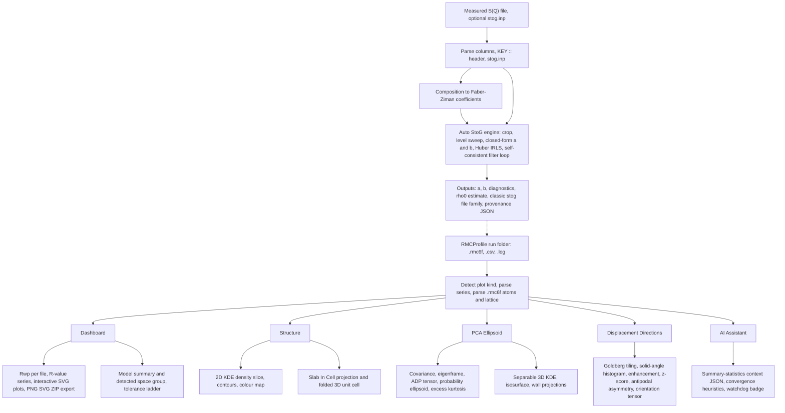

# Algorithms and Math Reference

A transparent, code-anchored account of **every mathematical operation the RMCProfile Workbench
performs on your data**, organised by app page. It exists so a scientist can audit how a plot, a
density map, a symmetry label, a scaled dataset, or a direction map on screen was actually produced:
which array was read, which window was cropped, which estimator was fitted, which tolerance decided
a branch, and which number is an approximation of another number. The app is
[browser-first](../README.md) — raw run files are read locally and never uploaded to any project
server — so most of what is described here executes in a Web Worker on the reader's own machine, and
the Python package is the reference implementation those workers were ported from.

Companions: [AGENTS.md](../AGENTS.md) (architecture map, conventions, current state) ·
[REFERENCE.md](REFERENCE.md) (setup, backend API, file formats) ·
[STOG_SCALING_PLAN.md](STOG_SCALING_PLAN.md) (the Auto StoG design + validation record) ·
[SCALING_PROCEDURE.md](SCALING_PROCEDURE.md) (the scaling procedure as a user-facing recipe).

---

## How to read this document

| | |
|---|---|
| **Math** | LaTeX, rendered natively by GitHub. `$…$` inline, `$$…$$` display. |
| **Anchoring** | Every step names a **file and a function** (`sine_transform()` in [`rmc_toolkits/transforms.py`](../rmc_toolkits/transforms.py)). Line numbers appear only for constants, thresholds and specific branches — the citations that go stale first. Tests are cited by node id. |
| **Two engines** | [`rmc_toolkits/`](../rmc_toolkits) is the **reference implementation**; the browser workers under [`web_app/frontend/src/workers/`](../web_app/frontend/src/workers) are hand-written **ports**. Exactly one port is parity-tested against committed **Python goldens**: `autoScale.js`. `pcaKde.js` and `orientation.js` are each pinned against their *own* in-language reference (a brute-force multivariate KDE written inside `pcaKde.test.js`; index-agnostic geometry assertions in `orientation.test.js`) — **no shared golden file connects them to Python**. `localKdeWorker.js` / `gpuKde.js` have no numerical reference test at all (`localKdeWorker.test.js` pins periodic-boundary *behaviour*, not densities). |
| **Grades** | *Reference-grade* = the Python path (float64, SciPy/LAPACK, contourpy), reached through `rmc-autoscale`, a Flask route against a server-side **directory**, or `rmc_toolkits` called directly. *Visualization-grade* = the browser port (float32 on the WebGPU branch, a different pseudo-random subsample and therefore a different bandwidth matrix, a Jacobi eigensolver, a tabulated $\chi^2$ quantile, a cruder contour tracer). Quote a browser number only where a section records a measured cross-engine bound and your number is inside it. See [notation.md §3d](algorithms/notation.md#3d-reference-grade-vs-visualization-grade). |
| **Precedence** | **The code wins.** Where this document and the source disagree, the source is correct and the document is a bug. |
| **Symbols** | One consolidated table, with the symbol *collisions* listed rather than silently merged: [algorithms/notation.md](algorithms/notation.md). |

---

## The pages

Ordered as the app's nav orders them (`web_app/frontend/src/App.jsx`). The **Auto StoG** tab is
gated behind `SHOW_AUTO_STOG = false` in the shipped build; the reference documents the code as
written.

| Page | What it computes | Reference |
|---|---|---|
| *(shared)* | Symbols, units, coordinate frames, symbol collisions, citation conventions, reference-grade vs visualization-grade | [Notation and conventions](algorithms/notation.md) |
| **Auto StoG** | Absolute-scale $(a,b)$ for a measured $S(Q)$: composition constants, sine-transform pair with Lorch/low-$Q$ correction/Fourier filter, level sweep + closed-form affine fit + self-consistent loop, $\rho_0$ estimate, and the written stog/RMCProfile file family | [Auto StoG](algorithms/auto-stog.md) |
| **Dashboard** | Run-folder detection and parsing, the "Rwp"/R-value metrics, the SVG plot renderer (ticks, zoom, hover, export), the model summary and the client-side space-group finder | [Run Dashboard](algorithms/run-dashboard.md) |
| **Atomic Density** *(the nav label; this reference calls the page **Structure**, and the page heading itself reads "KDE And Folded Unit Cell")* | Supercell folded into one cell: the 2-D Gaussian KDE slice (CPU + WGSL), contours and colour mapping, the Slab In Cell projection, and the Three.js folded unit-cell view | [Structure](algorithms/structure.md) |
| **PCA Ellipsoid** | Per-site displacement clouds: covariance, eigen-decomposition, ADP readouts, $\chi^2$ probability ellipsoid, separable 3-D Gaussian KDE + marching-cubes isosurface, wall projections, excess kurtosis, and the PCA↔crystal frame algebra | [PCA Ellipsoid](algorithms/pca-ellipsoid.md) |
| **Displacement Directions** | Directions only, amplitude discarded: Goldberg (hex + 12 pentagon) sphere tiling, exact solid-angle histogram, enhancement/$z$-score, antipodal asymmetry, orientation tensor, and the sphere/axis-view rendering | [Displacement Directions](algorithms/displacement-directions.md) |
| **AI Assistant** | The run context built *before* any model call: cell/composition, symmetry orbits, per-site PCA summary, average-structure neighbour distances, $g(r)$ peak extraction, residuals, convergence heuristics, character budget — and exactly what leaves the device | [AI Assistant](algorithms/ai-assistant.md) |

---

## Pipeline at a glance



The dotted edge is the workflow link, not a code path: Auto StoG writes the RMCProfile-ready
`.sq`/`.gr` family that an RMCProfile run later consumes. That family is **not** re-readable as a
chart on the Dashboard — `isDashboardPlotFile` in `Dashboard.jsx` drops every file with
`plotKind === 'stog'` on all three load paths, and Flask's file listing (`SUPPORTED_PATTERNS` in
`app.py`) does not even return `.gr`/`.fq` (only `*.sq` and literal `scale_ft.*`) —
[run-dashboard.md](algorithms/run-dashboard.md#caveats--what-this-is-not).

---

## Where each computation runs

| Computation | Python package (`rmc_toolkits/`) | Flask backend (`web_app/backend/app.py`) | Browser worker / module |
|---|---|---|---|
| S(Q) + `stog.inp` + `KEY :: ` parsing | `parsers.py` (`read_stog_inp`, `read_dat_header`) | `parsers.py` via `_resolve_scaling_source()` | `workers/autoScale.js` |
| Faber-Ziman coefficients (Sears table, 89 elements) | `scattering.py` | via engine call | `workers/autoScale.js` → `faberZiman()` |
| Keen conversions, sine-transform pair, Lorch, low-$Q$ correction, Fourier filter, low-$r$ enforcement | `transforms.py` | via engine call | `workers/autoScale.js` |
| Auto StoG fit: level sweep, closed-form $(a,b)$, Huber IRLS, self-consistent loop, `estimate_rho0` | `scaling.py` | `/api/scaling/preview`, `/api/scaling/run` (**no** $\rho_0$ self-consistency) | `workers/autoScale.js` + `autoScaleWorker.js` — **always**, in both runtimes |
| stog output family + provenance JSON | `scaling_cli.py` (`rmc-autoscale`) | shares the CLI writer (8 data files byte-identical; provenance differs) | `AutoStogPage.jsx` → `writeStogXy` / `buildZip` |
| Run-file detection, series parsing, `rwp` | `plots.py`, `parsers.py` | `/api/plot`, `/api/plot/data`, `/api/plot/metadata` | `browserData.js` |
| Plot rendering | `plots.py` (matplotlib — not used by the SPA) | PNG endpoint | `InteractivePlot.jsx` (SVG), `figureExport.js`, `zipArchive.js` |
| Space-group detection + tolerance ladder | — | — | `symmetry.js`, `symmetryModel.js` (**browser only**) |
| 2-D KDE density slice + contours | `kde.py` (`scipy.stats.gaussian_kde`, contourpy) | `/api/kde/slice` | `workers/localKdeWorker.js`, `workers/gpuKde.js` (WGSL) |
| Per-site clouds, ADP, separable 3-D KDE | `pca_kde.py` | `/api/pca/sites`, `/api/pca/kde` | `workers/pcaKde.js`, `workers/pcaKdeWorker.js` |
| Isosurface extraction | — | — | `workers/marchingCubes.js` (**browser only**) |
| Orientation histogram on the Goldberg sphere | `orientation.py` | `/api/pca/orientation` | `workers/orientation.js` |
| Bond-angle (triplet) distribution | `triplets.py` (`rmc-triplets` CLI; `bond_angle_summary` is the payload contract) | `/api/triplets` | `workers/triplets.js` (parity-tested vs Python goldens), UI in `LocalGeometryPage.jsx` |
| `.rmc6f` atoms + lattice → folded unit cell | `parsers.py` (`read_cell_vectors`, `read_atom_indices`, `iter_rmc6f_atoms`) | `/api/structure` (site-stratified subsample, `MAX_STRUCTURE_POINTS`) | `browserData.js` → `structureFromRmc6f()` (atom lines via `parseAtomLine()` in `rmc6f.js`), run off the main thread by `workers/localStructureWorker.js` (instantiated in `Dashboard.jsx` and `StructurePage.jsx`) |
| PCA↔crystal frame algebra | — | — | `pcaCrystalFrame.js` — `unitCellVectors()` is on the **production UI path** (imported by `useSiteCloud.js`; drives the crystal-frame axis rods, the shadow box and the axis-framing cameras in `PcaKdePage.jsx`); `crystalPcaTransforms` / `principalAxisOrientation` are exercised **only by unit tests** |
| Assistant context, pair correlations, convergence heuristics | — | — | `src/llm/` (**browser only**; the backend is never involved in an assistant request) |

**For the Structure and PCA pages the engine is chosen by the run *source*, not by the build mode.**
`StructurePage.jsx` branches on `Boolean(localRun)` alone, and `requestPca()` in `useSiteCloud.js`
routes to the shared worker whenever a local `.rmc6f` *text* is loaded. So a full Flask session that
opens the bundled **Demo** run — or any folder picked through the browser file picker — reads
**JavaScript** numbers; only a typed backend **directory** goes through the HTTP routes. Proof from
the code in [structure.md](algorithms/structure.md#structure-page--kde-density-slices) and
[pca-ellipsoid.md](algorithms/pca-ellipsoid.md#pca-ellipsoid-page--displacement-clouds-adp-tensors-and-the-separable-3d-kde);
summarised in [notation.md §3c](algorithms/notation.md#3c-the-two-runtime-modes). The KDE **volume
line** on the PCA page prints `· browser` or `· server` (from `kde.browserPcaKde`,
`PcaKdePage.jsx`), so the provenance is on screen once a volume has been computed — the ADP and
eigenvalue statistics on their own carry no provenance marker.

---

## Limitations and approximations at a glance

Consolidated from every page's *Caveats* section. Each line links to the section that explains it.

**Sampling and subsampling**

- Structure KDE fits **at most 6000** slab points (deterministic pseudo-random), so its pointwise noise grows as $\sqrt{N/6000}$ and the bandwidth is seed-dependent — [structure.md](algorithms/structure.md#step-5--deterministic-pseudo-random-subsampling-to-6000-fit-points).
- PCA clouds are subsampled above 20 000 points, and the two engines draw **different** subsamples — [pca-ellipsoid.md](algorithms/pca-ellipsoid.md#caveats--what-this-is-not).
- The Displacement Directions engine subsamples **nothing** and has no RNG, but the shipped default resolution ($\nu=10$) over-bins by its own `recommendedFrequency` criterion (~1 count/cell) — [displacement-directions.md](algorithms/displacement-directions.md#caveats-1).
- The model-summary point cloud is a 100-atom subsample drawn by two different algorithms — [run-dashboard.md](algorithms/run-dashboard.md#caveats--what-this-is-not).

**Visualization path vs reference path**

- The browser Structure KDE is a **picture, not a measurement**: no cross-runtime numerical test exists, bandwidth matrices genuinely differ, and the GPU branch is float32 throughout ($10^{-6}$–$10^{-5}$ relative, untested) — [structure.md](algorithms/structure.md#caveats--what-this-is-not).
- KDE density units are fractional (the cell carries unit mass, not Å⁻²), the colour scale is per-slice with no colorbar, and the colormaps are 5-anchor approximations of the matplotlib maps — [structure.md](algorithms/structure.md#caveats--what-this-is-not).
- In log mode the Flask path can silently drop all contours where the browser path draws them — [structure.md](algorithms/structure.md#step-9--contour-extraction).
- The PCA engines are each pinned to their own reference, **not to each other**: no golden-file parity test between `pca_kde.py` and `pcaKde.js`; known differences are the $\chi^2$ quantile table (up to $+3.5\%$ on the semi-axes at $p=0.97$) and the subsample draw — [pca-ellipsoid.md](algorithms/pca-ellipsoid.md#caveats--what-this-is-not).
- Server mode cannot read coordinates-only `.rmc6f` files; the fold-and-cluster site reconstruction is a browser-only **heuristic** governed by a distance knob — [pca-ellipsoid.md](algorithms/pca-ellipsoid.md#step-1--parse-rmc6f-into-per-site-displacement-clouds).

**Port-parity tolerances (measured, not assumed)**

- Auto StoG: level rel. err. $<10^{-9}$, $(a,b)$ rel. err. $<10^{-6}$, `iterations` exactly equal — but the $\rho_0$ self-consistency agrees only to $\sim10^{-4}$, an algorithmic divergence (the JS filter omits `s0Target` inside the loop), not float noise — [auto-stog.md](algorithms/auto-stog.md#cross-engine-agreement-browser-vs-python).
- PCA ellipsoids and orientation have **no measured, enforced port-parity bound at all**. Python is pinned to SciPy (`tests/test_pca_kde.py::test_volume_matches_scipy_gaussian_kde`, `rtol=1e-9, atol=1e-12`) and the JS engine to the test's own brute force ($<10^{-9}$): two *parallel* suites, no shared golden — [pca-ellipsoid.md](algorithms/pca-ellipsoid.md#caveats--what-this-is-not). (The $5\times10^{-16}$ figure quoted for the orientation frame is a **Python-vs-Python** check — `site_orientation_histogram`'s covariance against `site_ellipsoids`' on a synthetic $8^3$ site — not a cross-engine number.)
- The one cross-engine orientation comparison that exists was run **once, on a dev machine, for this document**, not by CI: $\le 9\times10^{-16}$ on the tiling at $\nu=4$ and $\le 3\times10^{-13}$ on the histogram float fields. Treat it as a verification, not a regression guard — [displacement-directions.md](algorithms/displacement-directions.md#parity-python-engine-vs-javascript-port).
- Anything not in a parity table has not been checked — [notation.md §3d](algorithms/notation.md#3d-reference-grade-vs-visualization-grade).

**Tolerance dependence in the symmetry finder**

- It is **not spglib and not FINDSYM**: no external space-group database, symmorphic symbols only (screw axes and glides are never detected, `Fd-3m`→`Fm-3m`), setting variants collapse, and `R` centering is unreachable — [run-dashboard.md](algorithms/run-dashboard.md#part-b--the-detected-sg-symmetry-finder).
- The metric tolerance $\epsilon_G=10^{-2}$ is **hard-wired** (≈1 Ų for a 10 Å cell), so a pseudo-cubic cell passes the lattice search; the only user-adjustable knob is $\tau$, set by clicking a ladder brick — [run-dashboard.md](algorithms/run-dashboard.md#part-b--the-detected-sg-symmetry-finder).
- The answer is tolerance-dependent **by design** — an RMC configuration is disordered; read the ladder, not a single symbol — [run-dashboard.md](algorithms/run-dashboard.md#caveats--what-this-is-not-2).

**Estimators, heuristics and models presented as numbers**

- "Rwp" is **unweighted** and normalized by the RMC-*calculated* column, and is per-file. A degenerate residual — no point finite in both columns, or a zero denominator — reports as the chip **"Rwp —"** rather than a number; a *partly* NaN column still yields a value, computed over silently fewer rows than the file has — [run-dashboard.md](algorithms/run-dashboard.md#caveats--what-this-is-not).
- The R-value curve is "the last whitespace column of the `.log`" — no header is consulted; in the bundled demo that column is `X_ray_(R)1` — [run-dashboard.md](algorithms/run-dashboard.md#step-5--compute-the-numbers).
- Plot classification is **by filename only** — no file's content is inspected, so a renamed file plots as something else and an unrecognized name is silently ignored (the "Loaded N plot files" panel counts only *chartable* files) — [run-dashboard.md](algorithms/run-dashboard.md#caveats--what-this-is-not).
- There is **no decimation** in the plot renderer, so a large enough visible point count throws `RangeError: Maximum call stack size exceeded` (spread into `Math.min`/`Math.max`) rather than degrading — [run-dashboard.md](algorithms/run-dashboard.md#caveats--what-this-is-not-1).
- Auto StoG's absolute scale is **not certifiable from inside the data**: a smooth low-$Q$ deficiency is absorbed into a biased $a$ with all residual diagnostics clean, and `density_limit_satisfied` is one-sided — [auto-stog.md](algorithms/auto-stog.md#caveats--what-this-is-not-2).
- The low-$Q$ correction is a **model** (linear $S(Q)$ on $[0,Q_\mathrm{min}]$ with a supplied $S(0)$), the transform is trapezoid quadrature with hard truncation at $Q_\mathrm{max}$, and the $r$ grid is ~11× oversampled relative to $\pi/Q_\mathrm{max}$ — [auto-stog.md](algorithms/auto-stog.md#caveats--what-this-is-not-1).
- Several physics parameters can be filled in silently ($\rho_0$, $r_0$, the $Q$ window, a 0.05 Å⁻³ seed); a wrong $\rho_0$ tracks $a$ roughly 1:1 — read the provenance JSON — [auto-stog.md](algorithms/auto-stog.md#caveats--what-this-is-not-2).
- The Sears table is **neutron, natural-abundance, real-part-only**; x-ray use requires setting $\langle b\rangle^2$ and $\langle b^2\rangle$ by hand, and isotopic $b$ overrides are a library-only knob — [auto-stog.md](algorithms/auto-stog.md#caveats--what-this-is-not).
- A KDE is a smoother, not a model: the isosurface is kernel-broadened by $\sqrt{1+f^2}$ (+10.2 % at $n=216$) while the drawn ellipsoid is not, and neither engine corrects for it — [pca-ellipsoid.md](algorithms/pca-ellipsoid.md#caveats--what-this-is-not).
- `U` is **Cartesian** — no $U_\mathrm{cif}$/$\beta_{ij}$ conversion anywhere; non-Gaussianity is three marginal kurtoses averaged, blind to skewness and multimodality; wall projections are per-plane normalised and not comparable between walls — [pca-ellipsoid.md](algorithms/pca-ellipsoid.md#caveats--what-this-is-not).
- A principal axis is a **line, not an arrow**, and near-degenerate eigenvalues make individual axes meaningless (the `degenerate` flag catches only the extreme case) — [pca-ellipsoid.md](algorithms/pca-ellipsoid.md#caveats--what-this-is-not-1).
- Goldberg cells are **not equal-area** ($-36\%$ to $+18\%$ at $\nu=10$); this is compensated in `density`/`enhancement` but raw `counts` print the icosahedron onto the map, and smoothing adds a small icosahedral artefact — [displacement-directions.md](algorithms/displacement-directions.md#caveats).
- `zScore` ignores the amplitude weight and mixes smoothed with raw quantities; at the default resolution the red ± asymmetry flag is **mathematically unreachable** ($3\sqrt{C/\pi N}>1$) — [displacement-directions.md](algorithms/displacement-directions.md#caveats-1).
- The assistant's $g(r)$ peak finder is a **cue extractor**, not a refinement (grid-snapped, zero-baseline FWHM, first two peaks below 6 Å), and its neighbour distances are average-structure distances that degenerate to a lattice repeat for a single-site element — [ai-assistant.md](algorithms/ai-assistant.md#caveats--what-this-is-not).
- Selecting a cloud provider discloses the summarized context — including up to 12 Wyckoff-orbit `frac` triples — under the user's own API key; local providers keep everything on the machine — [ai-assistant.md](algorithms/ai-assistant.md#data-flow--precisely-what-leaves-the-device).

**Geometry and display conventions that are not what they look like**

- Everything geometric on the Structure page happens in **fractional space**: the kernel is isotropic in fractional coordinates (hence anisotropic in Å for any non-cubic cell), the custom "direction" is a Miller triple $(hkl)$, and the periodic wrap is exact only out to the margin $m$ — [structure.md](algorithms/structure.md#caveats--what-this-is-not).
- Every Structure panel superimposes all $N_1N_2N_3$ supercell copies; the 3-D view has no bonds, no chemical radii and no lighting; the "slab" is two lids, not a solid — [structure.md](algorithms/structure.md#caveats--what-this-is-not-1).
- Both 2-D projections are oblique for a general cell, the two runtimes pick different in-plane axes for a custom normal, and the `b` preset triad is left-handed — [structure.md](algorithms/structure.md#caveats--what-this-is-not-1).
- The crystal-mode shadow box is **not a unit cell** (Gram–Schmidt on $\mathbf a,\mathbf b$; $\mathbf c$ is never read), and $[u\,v\,w]\neq(hkl)$ for a non-isotropic metric — [pca-ellipsoid.md](algorithms/pca-ellipsoid.md#caveats--what-this-is-not-1).
- Hover readouts are rounded to 4 significant digits, the hover search is x-only and unbounded, NaN gaps are bridged silently, and series identity is the label string — [run-dashboard.md](algorithms/run-dashboard.md#caveats--what-this-is-not-1).

**Computed but not displayed (or displayed but not reachable)**

- `principalAxisOrientation` and `crystalPcaTransforms` — angles to $a$/$b$/$c$, $[u\,v\,w]$ indices, fractional↔PCA matrices — are exercised **only by unit tests**; no UI panel prints them — [pca-ellipsoid.md](algorithms/pca-ellipsoid.md#step-10--computed-but-not-currently-displayed).
- `dispA` (a circular-statistics scalar on the fractional axes) exists only in the browser structure parser and never appears in a panel — [pca-ellipsoid.md](algorithms/pca-ellipsoid.md#step-11--a-different-displacement-measure-dispa).
- Several orientation quantities are computed and returned but never rendered — [displacement-directions.md](algorithms/displacement-directions.md#step-14--computed-but-not-displayed).
- `chi_q` (the second-to-last log column) is parsed in Python and never displayed; the convergence badge is off by default — [run-dashboard.md](algorithms/run-dashboard.md#caveats--what-this-is-not).
- The **Auto StoG tab is not in the shipped build** (`SHOW_AUTO_STOG = false` in `App.jsx`), and a ticked "Enforce low-r" can be silently skipped when first-shell detection fails — [auto-stog.md](algorithms/auto-stog.md#caveats--what-this-is-not-3).

---

## Reproducing these numbers yourself

### Python package (the reference implementation)

```bash
python3 -m venv .venv
source .venv/bin/activate
pip install -r web_app/backend/requirements.txt   # web app
pip install -e .                                   # rmc_toolkits package (editable)
```

```python
from rmc_toolkits import (
    detect_plot_kind, kde_slice, load_unit_cell_positions,
    make_plot, plot_to_png, read_exafs_csv, read_structure, write_frac_from_rmc6f,
)

demo = "web_app/frontend/public/demo"  # bundled GaTa4Se8 250 K example run

# Note: with no explicit destination this writes `Frac_coord_GTS_250K.txt` *beside the input*,
# i.e. into the tracked demo folder. Point it at scratch space to keep the tree clean.
frac_path = write_frac_from_rmc6f(
    f"{demo}/GTS_250K.rmc6f", "/tmp/Frac_coord_GTS_250K.txt", overwrite=True
)
structure = read_structure(demo)

positions = load_unit_cell_positions(f"{demo}/GTS_250K.rmc6f", element="Ga")
payload = kde_slice(
    positions.positions,
    z_center=0.5 * positions.cell_lengths[2],
    dz=0.08 * positions.cell_lengths[2],
    xlim=(0.0, float(positions.cell_lengths[0])),
    ylim=(0.0, float(positions.cell_lengths[1])),
)

png_bytes = plot_to_png(make_plot(f"{demo}/GTS_250K_FQ1.csv"))
```

Lower-level helpers are exported too (`read_rmc_csv`, `read_chi`, `read_cell_vectors`,
`iter_rmc6f_atoms`, `rwp`, …); the PCA, orientation and scaling engines are
`rmc_toolkits.pca_kde`, `rmc_toolkits.orientation`, `rmc_toolkits.scaling` +
`rmc_toolkits.transforms`. Full list in [REFERENCE.md](REFERENCE.md#python-package-usage).

### `rmc-autoscale` CLI (Auto StoG, reference-grade)

Console entry point installed by `pip install -e .`
([`rmc_toolkits/scaling_cli.py`](../rmc_toolkits/scaling_cli.py); module form
`python -m rmc_toolkits.scaling_cli`). Outputs default into `autoscale/` beside the input and
nothing is overwritten without `--force`.

```bash
rmc-autoscale --help                      # every flag, grouped as in the reference
rmc-autoscale stog.inp                    # classic stog.inp mode; auto-fit is the default
rmc-autoscale stog.inp --manual           # classic-stog parity run (uses the inp's yscale/yoffset)
rmc-autoscale --data sofq.dat --qmin 0.5 --qmax 28 --formula SrTiO3 --rho0 0.0853
rmc-autoscale --data sofq.dat --qmin 0.5 --qmax 28 --formula SrTiO3 --estimate-rho0
```

`--amplitude density|fz` selects the amplitude criterion, `--c1-mode sweep|joint` the high-$Q$
architecture, `--lorch/--no-lorch`, `--robust/--no-robust`, `--despike`,
`--low-q-correction/--no-low-q-correction` and `--sigma/--no-sigma` control the conditioning, and
`--out-dir`/`--out-stem`/`--force` control the written family. `--estimate-rho0` requires
$\langle b^2\rangle$ (via `--b-sq-avg` or `--formula`) and has **no** HTTP counterpart.

### `rmc-triplets` CLI (bond-angle distribution, engine-only for now)

Console entry point installed by `pip install -e .`
([`rmc_toolkits/triplets_cli.py`](../rmc_toolkits/triplets_cli.py); module form
`python -m rmc_toolkits.triplets_cli`). Nothing is overwritten without `--force`. The RMCProfile
`triplets`-style workflow: name an A–B–C
triplet with **B the central atom**, bound the two bond lengths (inclusive windows, Å), and
histogram the angle at B over $[0°, 180°]$.

```bash
rmc-triplets --help
rmc-triplets data/5K_try1 --triplet Se Nb Se --bond12 2.2 2.9 --plot se_nb_se.png
rmc-triplets config.rmc6f --triplet O Ti O --bond12 1.7 2.3 --bond23 1.7 2.3 --bin-width 0.5
```

The engine (`rmc_toolkits/triplets.py`, module docstring is the math reference) finds neighbours
with a linked-cell search carrying **explicit periodic-image shifts** — exact for any cell shape,
triclinic included, and for boxes smaller than the cutoff, where multiple images of one atom are
genuine distinct neighbours (`tests/test_triplets.py` pins exact agreement with a brute-force
all-images reference). The CSV carries three curves: raw `counts`; `density`, a per-degree
probability density with unit integral; and `sin_corrected`, the count fraction divided by the
*exact* isotropic bin fraction $(\cos\theta_1-\cos\theta_2)/2$ — the `sinth` normalization computed
from the bin integral rather than $1/\sin\theta_c$, so the 0° and 180° bins stay finite. Equivalent
ends (same element, same window) count each unordered bond pair once; distinct windows count
ordered (1→2, 2→3) assignments. Engine-only for now: no Flask route, browser port, or page yet.

### Test suites

```bash
source .venv/bin/activate
MPLCONFIGDIR=/tmp/rmc_toolkits_matplotlib python -m unittest discover -s tests

# Frontend unit tests (vitest)
cd web_app/frontend && npm test

# Lint frontend
cd web_app/frontend && npx eslint src
```

| Suite | What it pins |
|---|---|
| `tests/test_transforms.py`, `tests/test_scaling.py`, `tests/test_scaling_cli.py`, `tests/test_scattering.py` | The Auto StoG engine, its transforms, the Faber-Ziman table, and the written file family (incl. skip-if-absent Fortran-run parity) |
| `tests/test_kde.py`, `tests/test_pca_kde.py`, `tests/test_orientation.py` | Reference KDE, separable-KDE equality against `scipy.stats.gaussian_kde`, Goldberg tiling and solid-angle histogram |
| `tests/test_parsers.py`, `tests/test_plots.py`, `tests/test_package_api.py`, `tests/test_backend_api.py` | Parsing, plot-kind detection, `rwp`, the exported API surface, and the Flask routes |
| `tests/generate_autoscale_fixture.py` → `src/__tests__/autoScale.test.js` | The Python→JS golden fixtures and the measured cross-engine tolerances |
| `src/workers/__tests__/pcaKde.test.js`, `orientation.test.js`, `localKdeWorker.test.js`, `marchingCubes.test.js` | The browser ports against their own references |
| `src/__tests__/pcaCrystalFrame.test.js`, `orientationSphere.test.js`, `rmc6f.test.js`, `browserData.test.js` | Frame algebra, sphere-mesh helpers, `.rmc6f` parsing, run assembly |
| `src/llm/__tests__/` | Assistant context construction, pair correlations, convergence heuristics, provider client |

Sample-data-backed tests skip when the `data/` GNSe sample is absent, so CI exercises only
logic/synthetic-fixture tests. CI: `.github/workflows/tests.yml`.

---

## Source of truth

**If this document and the code disagree, the code wins.** The reference was derived by reading the
following, grouped by module:

| Group | Files |
|---|---|
| Python engines | [`rmc_toolkits/`](../rmc_toolkits) — `parsers.py`, `plots.py`, `kde.py`, `pca_kde.py`, `orientation.py`, `transforms.py`, `scaling.py`, `scattering.py`, `scaling_cli.py` |
| Flask API | [`web_app/backend/app.py`](../web_app/backend/app.py) (routes, data-root guard, LRU caches) |
| Browser workers | [`web_app/frontend/src/workers/`](../web_app/frontend/src/workers) — `autoScale.js`, `autoScaleWorker.js`, `localKdeWorker.js`, `gpuKde.js`, `pcaKde.js`, `pcaKdeWorker.js`, `orientation.js`, `localStructureWorker.js`, `marchingCubes.js` |
| Frontend pages | [`web_app/frontend/src/components/`](../web_app/frontend/src/components) — `AutoStogPage.jsx`, `Dashboard.jsx`, `InteractivePlot.jsx`, `StructurePage.jsx`, `PcaKdePage.jsx`, `OrientationPage.jsx`, `OrientationView.jsx`, `SiteStructurePanel.jsx`, `ModelSummary.jsx`, `sceneAxes.js` |
| Frontend modules | [`web_app/frontend/src/`](../web_app/frontend/src) — `App.jsx` (nav order, `SHOW_AUTO_STOG`), `browserData.js`, `useSiteCloud.js`, `symmetry.js`, `symmetryModel.js`, `pcaCrystalFrame.js`, `orientationSphere.js`, `rmc6f.js`, `colormaps.js`, `atomColors.js`, `figureExport.js`, `zipArchive.js` |
| Assistant | [`web_app/frontend/src/llm/`](../web_app/frontend/src/llm) — `context/`, `watchdog/`, `prompts/`, `provider/`, `useAssistant.js`, `components/` |
| Tests | [`tests/`](../tests) and `web_app/frontend/src/**/__tests__/` |
| Project docs consulted | [AGENTS.md](../AGENTS.md), [README.md](../README.md), [QuickStart.md](../QuickStart.md), [REFERENCE.md](REFERENCE.md), [STOG_SCALING_PLAN.md](STOG_SCALING_PLAN.md), [SCALING_PROCEDURE.md](SCALING_PROCEDURE.md), [CHANGELOG.md](CHANGELOG.md) |

This reference describes the repository at commit **`79f7c60`** on branch **`main`**. Line-number
citations are pointers into the source as it stood at that commit, not permanent addresses; function
names and file paths are the durable part of every citation.
