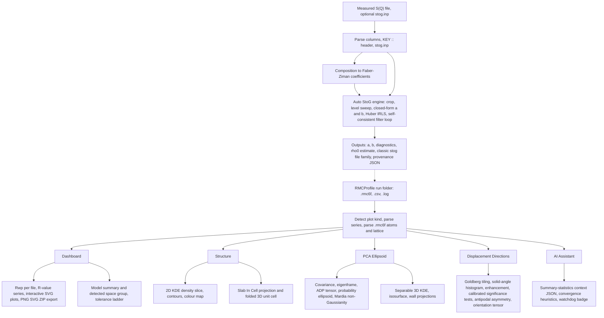

# Algorithms and Math Reference

A transparent, code-anchored account of **every mathematical operation the RMCProfile Workbench
performs on your data**, organised by app page. It exists so a scientist can audit how a plot, a
density map, a symmetry label, a scaled dataset, or a direction map on screen was actually produced:
which array was read, which window was cropped, which estimator was fitted, which tolerance decided
a branch, and which number is an approximation of another number. The app is
[browser-first](../README.md) — raw run files are read locally and never uploaded to any project
server — so most of what is described here executes in a Web Worker on the reader's own machine, and
the Python package is the reference implementation those workers were ported from.

Companions: [AGENTS.md](../AGENTS.md) (architecture map, conventions, current state) ·
[REFERENCE.md](REFERENCE.md) (setup, backend API, file formats) ·
[STOG_SCALING_PLAN.md](STOG_SCALING_PLAN.md) (the Auto StoG design + validation record) ·
[SCALING_PROCEDURE.md](SCALING_PROCEDURE.md) (the scaling procedure as a user-facing recipe).

---

## How to read this document

| | |
|---|---|
| **Math** | LaTeX, rendered natively by GitHub. `$…$` inline, `$$…$$` display. |
| **Anchoring** | Every step names a **file and a function** (`sine_transform()` in [`rmc_toolkits/transforms.py`](../rmc_toolkits/transforms.py)). Line numbers appear only for constants, thresholds and specific branches — the citations that go stale first. Tests are cited by node id. |
| **Two engines** | [`rmc_toolkits/`](../rmc_toolkits) is the **reference implementation**; the browser workers under [`web_app/frontend/src/workers/`](../web_app/frontend/src/workers) are hand-written **ports**. Four ports are parity-tested against **Python goldens**: `autoScale.js` (committed fixture, `tests/generate_autoscale_fixture.py`), `localKdeWorker.js` (`kde_parity_fixture.json`, written by `tests/generate_kde_fixture.py` and checked by `kdeParity.test.js` to $10^{-6}$ of the peak on slabs below the 6000-point fit cap), `triplets.js` (`triplets_fixture.json`) and `orientation.js` (values pinned verbatim in `tests/test_orientation_fixes.py` and `orientationFixes.test.js`, on an RNG-free golden cloud, to $10^{-9}$ relative). The shared `.rmc6f` parser and the plot readers have goldens too (`rmc6f_coords_only_fixture.json`, `plot_parity_fixture.json`). `gpuKde.js` is checked by a float32 emulation of its shader (`gpuKdeEmulation.test.js`; no test runs a real GPU). `pcaKde.js` is pinned against its *own* in-language reference (a brute-force multivariate KDE written inside `pcaKde.test.js`) and mirrors the Python regression scenarios (`pcaKdeRegressions.test.js` ↔ `tests/test_pca_regressions.py`) — **no shared golden file connects it to Python**. |
| **Grades** | *Reference-grade* = the Python path (float64, SciPy/LAPACK, contourpy), reached through `rmc-autoscale`, a Flask route against a server-side **directory**, or `rmc_toolkits` called directly. *Visualization-grade* = the browser port (float32 on the WebGPU branch, a different pseudo-random subsample above the fit caps, a Jacobi eigensolver, an exact but separately implemented $\chi^2$ quantile, a cruder contour tracer). Quote a browser number only where a section records a measured cross-engine bound and your number is inside it. See [notation.md §3d](algorithms/notation.md#3d-reference-grade-vs-visualization-grade). |
| **Precedence** | **The code wins.** Where this document and the source disagree, the source is correct and the document is a bug. |
| **Symbols** | One consolidated table, with the symbol *collisions* listed rather than silently merged: [algorithms/notation.md](algorithms/notation.md). |

---

## The pages

Ordered as the app's nav orders them (`web_app/frontend/src/App.jsx`). The **Auto StoG** tab is
gated behind `SHOW_AUTO_STOG = false` in the shipped build; the reference documents the code as
written.

| Page | What it computes | Reference |
|---|---|---|
| *(shared)* | Symbols, units, coordinate frames, symbol collisions, citation conventions, reference-grade vs visualization-grade | [Notation and conventions](algorithms/notation.md) |
| **Auto StoG** | Absolute-scale $(a,b)$ for a measured $S(Q)$: composition constants, sine-transform pair with Lorch/low-$Q$ correction/Fourier filter, level sweep + closed-form affine fit + self-consistent loop, $\rho_0$ estimate, and the written stog/RMCProfile file family | [Auto StoG](algorithms/auto-stog.md) |
| **Dashboard** | Run-folder detection and parsing, the "Rwp"/R-value metrics, the SVG plot renderer (ticks, zoom, hover, export), the model summary and the client-side space-group finder | [Run Dashboard](algorithms/run-dashboard.md) |
| **Atomic Density** *(the nav label; this reference calls the page **Structure**, and the page heading itself reads "KDE And Folded Unit Cell")* | Supercell folded into one cell: the 2-D Gaussian KDE slice (CPU + WGSL), contours and colour mapping, the Slab In Cell projection, and the Three.js folded unit-cell view | [Structure](algorithms/structure.md) |
| **Bond Geometry** | Bond angles at a central atom over the periodic configuration: linked-cell neighbour search with explicit image shifts, the three angle curves (counts, per-degree density, exact sin-corrected), bond-length histograms, coordination statistics, and the page's partial-g(r) helper and folded-cell bond view | [Bond Geometry](algorithms/bond-geometry.md) |
| **PCA Ellipsoid** | Per-site displacement clouds: covariance, eigen-decomposition, ADP readouts, $\chi^2$ probability ellipsoid, separable 3-D Gaussian KDE + marching-cubes isosurface, wall projections, Mardia non-Gaussianity and per-axis kurtosis, and the PCA↔crystal frame algebra | [PCA Ellipsoid](algorithms/pca-ellipsoid.md) |
| **Displacement Directions** | Directions only, amplitude discarded: Goldberg (hex + 12 pentagon) sphere tiling, exact solid-angle histogram, enhancement, calibrated peak/map/asymmetry/anisotropy significance tests, antipodal asymmetry, orientation tensor, and the sphere/axis-view rendering | [Displacement Directions](algorithms/displacement-directions.md) |
| **AI Assistant** | The run context built *before* any model call: cell/composition, symmetry orbits, per-site PCA summary, average-structure neighbour distances, $g(r)$ peak extraction, residuals, convergence heuristics, character budget — and exactly what leaves the device | [AI Assistant](algorithms/ai-assistant.md) |

---

## Pipeline at a glance


```mermaid
flowchart TD
  SQ["Measured S(Q) file, optional stog.inp"]
  RUN["RMCProfile run folder: .rmc6f, .csv, .log"]

  PSQ["Parse columns, KEY :: header, stog.inp"]
  FZ["Composition to Faber-Ziman coefficients"]
  ENG["Auto StoG engine: crop, level sweep, closed-form a and b, Huber IRLS, self-consistent filter loop"]
  EXP["Outputs: a, b, diagnostics, rho0 estimate, classic stog file family, provenance JSON"]

  PRUN["Detect plot kind, parse series, parse .rmc6f atoms and lattice"]

  DASH["Dashboard"]
  MET["Rwp per file, R-value series, interactive SVG plots, PNG SVG ZIP export"]
  SYM["Model summary and detected space group, tolerance ladder"]

  STR["Structure"]
  KDE["2D KDE density slice, contours, colour map"]
  SLAB["Slab In Cell projection and folded 3D unit cell"]

  PCA["PCA Ellipsoid"]
  ADP["Covariance, eigenframe, ADP tensor, probability ellipsoid, Mardia non-Gaussianity"]
  VOL["Separable 3D KDE, isosurface, wall projections"]

  DIR["Displacement Directions"]
  ORI["Goldberg tiling, solid-angle histogram, enhancement, calibrated significance tests, antipodal asymmetry, orientation tensor"]

  AI["AI Assistant"]
  CTX["Summary-statistics context JSON, convergence heuristics, watchdog badge"]

  SQ --> PSQ
  PSQ --> FZ
  FZ --> ENG
  PSQ --> ENG
  ENG --> EXP
  EXP -.-> RUN

  RUN --> PRUN
  PRUN --> DASH
  PRUN --> STR
  PRUN --> PCA
  PRUN --> DIR
  PRUN --> AI

  DASH --> MET
  DASH --> SYM
  STR --> KDE
  STR --> SLAB
  PCA --> ADP
  PCA --> VOL
  DIR --> ORI
  AI --> CTX
```

The dotted edge is the workflow link, not a code path: Auto StoG writes the RMCProfile-ready
`.sq`/`.gr` family that an RMCProfile run later consumes. That family is **not** re-readable as a
chart on the Dashboard — `isDashboardPlotFile` in `Dashboard.jsx` drops every file with
`plotKind === 'stog'` on all three load paths, and Flask's file listing (`SUPPORTED_PATTERNS` in
`app.py`) does not even return `.gr`/`.fq` (only `*.sq` and literal `scale_ft.*`) —
[run-dashboard.md](algorithms/run-dashboard.md#caveats--what-this-is-not).

---

## Where each computation runs

| Computation | Python package (`rmc_toolkits/`) | Flask backend (`web_app/backend/app.py`) | Browser worker / module |
|---|---|---|---|
| S(Q) + `stog.inp` + `KEY :: ` parsing | `parsers.py` (`read_stog_inp`, `read_dat_header`) | `parsers.py` via `_resolve_scaling_source()` | `workers/autoScale.js` |
| Faber-Ziman coefficients (Sears table, 89 elements) | `scattering.py` | via engine call | `workers/autoScale.js` → `faberZiman()` |
| Keen conversions, sine-transform pair, Lorch, low-$Q$ correction, Fourier filter, low-$r$ enforcement | `transforms.py` | via engine call | `workers/autoScale.js` |
| Auto StoG fit: level sweep, closed-form $(a,b)$, Huber IRLS, self-consistent loop, first-shell detection + data-located low-$r$ window, automatic enforcement cutoff, `estimate_rho0` | `scaling.py` | `/api/scaling/preview`, `/api/scaling/run` (**no** $\rho_0$ self-consistency) | `workers/autoScale.js` + `autoScaleWorker.js` — **always**, in both runtimes |
| stog output family + provenance JSON | `scaling_cli.py` (`rmc-autoscale`) | shares the CLI writer (8 data files byte-identical; provenance differs) | `AutoStogPage.jsx` → `writeStogXy` / `buildZip` |
| Run-file detection, series parsing, `fit_rwp` (normalized by the experimental column) | `plots.py`, `parsers.py` | `/api/plot`, `/api/plot/data`, `/api/plot/metadata` | `browserData.js` (parity golden `plot_parity_fixture.json`) |
| Plot rendering | `plots.py` (matplotlib — not used by the SPA) | PNG endpoint | `InteractivePlot.jsx` (SVG), `figureExport.js`, `zipArchive.js` |
| Space-group detection + tolerance ladder | — | — | `symmetry.js`, `symmetryModel.js`, `spaceGroupSymbol.js`, `spaceGroupTable.js`, `wyckoff.js` (**browser only**, main thread; no Python source of truth) |
| 2-D KDE density slice + contours | `kde.py` (`_FixedCovarianceKDE`, a `scipy.stats.gaussian_kde` subclass with the slab-atom kernel; contourpy) | `/api/kde/slice` | `workers/localKdeWorker.js`, `workers/gpuKde.js` (WGSL), `workers/slabSelection.js` (shared slab test, labels, σ and thickness in Å) |
| Per-site clouds, ADP, separable 3-D KDE | `pca_kde.py` | `/api/pca/sites`, `/api/pca/kde` | `workers/pcaKde.js`, `workers/pcaKdeWorker.js` |
| Isosurface extraction | — | — | `workers/marchingCubes.js` (**browser only**) |
| Orientation histogram on the Goldberg sphere | `orientation.py` | `/api/pca/orientation` | `workers/orientation.js` |
| Bond-angle (triplet) distribution | `triplets.py` (`rmc-triplets` CLI; `bond_angle_summary` is the payload contract, `bond_angle_summary_from_file` the file entry point) | `/api/triplets` | `workers/triplets.js` (parity-tested vs Python goldens), UI in `BondGeometryPage.jsx` |
| `.rmc6f` atoms + lattice → folded unit cell | `parsers.py` (`read_cell_vectors`, `read_atom_indices`, the shared atom-line grammar `classify_rmc6f_atom_line` → `iter_rmc6f_atoms` / `parse_rmc6f_atoms` with `Rmc6fParseReport`, and `find_run_configuration` for which `.rmc6f` a run folder means) | `/api/structure` (site-stratified subsample, `MAX_STRUCTURE_POINTS`) | `browserData.js` → `structureFromRmc6f()` (atom lines via `parseRmc6fAtoms()` / `classifyAtomLine()` in `rmc6f.js`, the same grammar), run off the main thread by `workers/localStructureWorker.js` (instantiated in `Dashboard.jsx`, `StructurePage.jsx` and `BondGeometryPage.jsx`) |
| PCA↔crystal frame algebra | — | — | `pcaCrystalFrame.js` — `unitCellVectors()` is on the **production UI path** (imported by `useSiteCloud.js`; drives the crystal-frame axis rods, the shadow box and the axis-framing cameras in `PcaKdePage.jsx`); `crystalOrientationRows` → `principalAxisOrientation` → `crystalPcaTransforms` render the *Crystal orientation* table, and `projectVolumeOntoFrame` computes the crystal-frame walls |
| Assistant context, pair correlations, convergence heuristics | — | — | `src/llm/` (**browser only**; the backend is never involved in an assistant request) |

**For the Structure and PCA pages the engine is chosen by the run *source*, not by the build mode.**
`StructurePage.jsx` branches on `Boolean(localRun)` alone, and `requestPca()` in `useSiteCloud.js`
routes to the shared worker whenever a local `.rmc6f` *text* is loaded. So a full Flask session that
opens the bundled **Demo** run — or any folder picked through the browser file picker — reads
**JavaScript** numbers; only a typed backend **directory** goes through the HTTP routes. Proof from
the code in [structure.md](algorithms/structure.md#structure-page--kde-density-slices) and
[pca-ellipsoid.md](algorithms/pca-ellipsoid.md#pca-ellipsoid-page--displacement-clouds-adp-tensors-and-the-separable-3d-kde);
summarised in [notation.md §3c](algorithms/notation.md#3c-the-two-runtime-modes). The KDE **volume
line** on the PCA page prints `· browser` or `· server` (from `kde.browserPcaKde`,
`PcaKdePage.jsx`), so the provenance is on screen once a volume has been computed — the ADP and
eigenvalue statistics on their own carry no provenance marker.

---

## Limitations and approximations at a glance

Consolidated from every page's *Caveats* section. Each line links to the section that explains it.

**Sampling and subsampling**

- Structure KDE fits **at most 6000** slab points (deterministic pseudo-random), so its pointwise noise grows as $\sqrt{N/6000}$; the kernel itself is fitted to all the slab's source atoms and does not depend on the subsample — [structure.md](algorithms/structure.md#step-5--deterministic-pseudo-random-subsampling-to-6000-fit-points).
- PCA clouds are subsampled above 20 000 points — for pooled clouds and for a single site in a box of ≥ 28 cells per edge — and the two engines draw **different** subsamples — [pca-ellipsoid.md](algorithms/pca-ellipsoid.md#caveats--what-this-is-not).
- The Displacement Directions engine subsamples **nothing** and has no RNG, but the shipped default resolution ($\nu=10$) over-bins by its own `recommendedFrequency` criterion (~1 count/cell); the calibrated readouts keep their false-alarm rates there, but real lobes are much harder to detect than on Auto — [displacement-directions.md](algorithms/displacement-directions.md#caveats-1).
- The model-summary point cloud is a 100-atom subsample drawn by two different algorithms — [run-dashboard.md](algorithms/run-dashboard.md#caveats--what-this-is-not).

**Visualization path vs reference path**

- The browser Structure KDE is a visualization path. Below the 6000-row fit cap (slab atoms plus their periodic images) its CPU branch reproduces the SciPy reference to $10^{-6}$ of the peak (golden-tested); above it the runtimes sum different subsamples, and maps differ by several percent of the peak (5.6–8.5 % measured on the demo run). The GPU branch is float32 (emulated: ~$3\times10^{-6}$, and $2\times10^{-4}$ for needle kernels; no test runs a real GPU) — [structure.md](algorithms/structure.md#caveats--what-this-is-not).
- KDE density units are fractional (not Å⁻²; the cell carries unit mass for the a/b/c presets only, and for oblique normals the section integral varies with the slice, 0.24–1.18 measured), the colour scale is per-slice with no colorbar, and the colormaps are 5-anchor approximations of the matplotlib maps — [structure.md](algorithms/structure.md#caveats--what-this-is-not).
- Contours are drawn only when the grid resolves the atoms (grid-summed linear density ≥ $10^{-6}$), in both runtimes and both scales. A map whose kernel falls between all grid nodes is flagged `unresolved` and is neither contoured nor painted; a kernel narrower than $10^{-10}$ (fractional units, e.g. `bw=1e-200`) is not evaluated and gives the flagged finite zero map. Before 0.6.0 the Flask path dropped every contour in log mode when the peak density was below 1, and both paths contoured such round-off — [structure.md](algorithms/structure.md#step-9--contour-extraction).
- The PCA engines are each pinned to their own reference, **not to each other**: no golden-file parity test between `pca_kde.py` and `pcaKde.js`; the known difference is the subsample draw above 20 000 points (the browser $\chi^2_3$ quantile is exact since 0.6.0) — [pca-ellipsoid.md](algorithms/pca-ellipsoid.md#caveats--what-this-is-not).
- Coordinates-only `.rmc6f` files are read by both runtimes' structure parsers, but server-mode PCA cannot reconstruct their sites; the fold-and-cluster site reconstruction is a browser-only **heuristic** governed by a distance knob — [pca-ellipsoid.md](algorithms/pca-ellipsoid.md#step-1--parse-rmc6f-into-per-site-displacement-clouds).

**Port-parity tolerances (measured, not assumed)**

- Auto StoG: level rel. err. $<10^{-9}$; $(a,b)$, the $\rho_0$ self-consistency estimate and its concordance rel. err. $<10^{-10}$; `converged`/`iterations` exactly equal — the engines agree to round-off (≤ $10^{-13}$ on the fixture, ≤ $5\times10^{-13}$ on every real run in `data/stog_tests`, refusals included). The pre-0.6.0 ~$10^{-4}$ $\rho_0$ gap was the JS filter omitting `s0Target` inside the loop, now fixed — [auto-stog.md](algorithms/auto-stog.md#cross-engine-agreement-browser-vs-python).
- PCA ellipsoids have **no measured, enforced port-parity bound**. Python is pinned to SciPy (`tests/test_pca_kde.py::test_volume_matches_scipy_gaussian_kde`, `rtol=1e-9, atol=1e-12`) and the JS engine to the test's own brute force ($<10^{-9}$): two *parallel* suites, no shared golden — [pca-ellipsoid.md](algorithms/pca-ellipsoid.md#caveats--what-this-is-not). (The $5\times10^{-16}$ figure quoted for the orientation frame is a **Python-vs-Python** check — `site_orientation_histogram`'s covariance against `site_ellipsoids`' on a synthetic $8^3$ site — not a cross-engine number.)
- Cross-engine orientation parity is guarded in CI by values shared verbatim between `tests/test_orientation_fixes.py` and `orientationFixes.test.js`: the `recommendedFrequency` table, the tie-resolved cells of the 26 ⟨100⟩/⟨110⟩/⟨111⟩ directions, `neighbors` checksums, and every significance statistic on an RNG-free golden cloud to $10^{-9}$ relative (JS `regularizedGamma`/`normalQuantile` pinned to SciPy). Measured on both GaNb₄Se₈ runs (104 sites × 7 settings): all integer and boolean fields identical, all floats ≤ $3\times10^{-13}$ relative. The full-array comparison ($\le 9\times10^{-16}$ on the tiling at $\nu=4$) was a one-off dev-machine verification — [displacement-directions.md](algorithms/displacement-directions.md#parity-python-engine-vs-javascript-port).
- Structure KDE and bond angles: see the golden fixtures above (KDE $10^{-6}$ of the peak below the fit cap; bond angles exact integer histograms and $10^{-9}$ floats).
- Anything not in a parity table has not been checked — [notation.md §3d](algorithms/notation.md#3d-reference-grade-vs-visualization-grade).

**Tolerance dependence in the symmetry finder**

- It is **not spglib and not FINDSYM**: there is no external space-group database, and no Python implementation or spglib cross-check exists. Screw axes and glides are read from each operation's intrinsic translation, so non-symmorphic groups are named as themselves (`Fd-3m`, `Pnma`, `I4/mcm`, and R groups on obverse hexagonal axes). Every reported operation set is a **closed group**, found greedily (not by subgroup enumeration). The group is named in a standard setting that the finder searches for from its own symmetry elements: the given cell, its axis orders, or a conventional cell built on the elements (a centred or primitive cell, or the true cell of a supercell). A symbol is accepted only if it is tabulated, belongs to the detected class and centring, and sits in a conventional cell; otherwise the card shows the crystal class with no number. A supercell whose lattice rotations the given cell cannot test is reported as a lower bound (`≥ P4/mmm`). Still missing: no origin shift (letters that need the table's coordinate form assume the structure's origin is the table's, so the same F-43m structure can read Ga 4c or 4d depending on the origin its `.rmc6f` uses; a tie that fits no form gets no letter, never a guessed one) and no idealized structure — [run-dashboard.md](algorithms/run-dashboard.md#part-b--the-detected-sg-symmetry-finder).
- The lattice test is a **Cartesian strain on the τ scale** (`latticeStrain()`, the largest displacement of a cell edge, in Å), not a hard-wired metric tolerance, and that strain is a floor on each operation's residual. A pseudo-cubic cell therefore reaches its cubic rungs only at a τ comparable to its distortion: a perovskite with c/a = 1.004 reads `P4/mmm` below 0.016 Å and `Pm-3m` above it. The only user-adjustable knob is τ, set by clicking a ladder brick — [run-dashboard.md](algorithms/run-dashboard.md#part-b--the-detected-sg-symmetry-finder).
- The finder runs **synchronously on the main thread**. A basis of more than 2000 sites, or a structure whose lattice rotations × pure translations at $\max(\tau, 1\,\text{Å})$ exceed 384 (a crystalline box declared as a 1×1×1 supercell), is reported `not analysed`, with no ladder — [run-dashboard.md](algorithms/run-dashboard.md#where-and-how-often-this-runs).
- The answer is tolerance-dependent **by design** — an RMC configuration is disordered; read the ladder, not a single symbol — [run-dashboard.md](algorithms/run-dashboard.md#caveats--what-this-is-not-2).

**Estimators, heuristics and models presented as numbers**

- "Rwp" is **unweighted** and normalized by the *experimental* column (RMCProfile's (x, calculated, experimental) order, or the roles the header names), and is per-file. A degenerate residual — no point finite in both columns, or a zero denominator — reports as the chip **"Rwp —"** rather than a number; a *partly* NaN column still yields a value, computed over silently fewer rows than the file has — [run-dashboard.md](algorithms/run-dashboard.md#caveats--what-this-is-not).
- The R-value curve is the χ² of the last `.log` column, one fit term named by its header (`X_ray_(R)1`, the X-ray real-space term in the demo), not the total; rows must match the header's column count, a half-written last line is dropped and non-finite rows stay as gaps — [run-dashboard.md](algorithms/run-dashboard.md#step-5--compute-the-numbers).
- Plot classification is **by filename only** — no file's content is inspected, so a renamed file plots as something else and an unrecognized name is silently ignored (the "Loaded N plot files" panel counts only *chartable* files) — [run-dashboard.md](algorithms/run-dashboard.md#caveats--what-this-is-not).
- There is **no decimation** in the plot renderer: every point is drawn, so a very long series costs rendering time (the axis domain is a one-pass scan, no longer an argument spread that threw `RangeError`) — [run-dashboard.md](algorithms/run-dashboard.md#caveats--what-this-is-not-1).
- Auto StoG's absolute scale is **not certifiable from inside the data**: a smooth low-$Q$ deficiency is absorbed into a biased $a$ with all residual diagnostics clean, and `density_limit_satisfied` is one-sided — [auto-stog.md](algorithms/auto-stog.md#caveats--what-this-is-not-2).
- The low-$Q$ correction is a **model** (linear $S(Q)$ on $[0,Q_\mathrm{min}]$ with a supplied $S(0)$), the transform is trapezoid quadrature with hard truncation at $Q_\mathrm{max}$, and the $r$ grid is ~11× oversampled relative to $\pi/Q_\mathrm{max}$ — [auto-stog.md](algorithms/auto-stog.md#caveats--what-this-is-not-1).
- Several physics parameters can be filled in silently ($\rho_0$, $r_0$, the $Q$ window, a 0.05 Å⁻³ seed); a wrong $\rho_0$ tracks $a$ roughly 1:1 — read the provenance JSON — [auto-stog.md](algorithms/auto-stog.md#caveats--what-this-is-not-2).
- Auto StoG fits the density limit only below the first coordination shell, which it locates from the data (the smallest-$r$ shell of either sign, confirmed on its own refit). When that shell starts within ~0.55 Å of $r_\mathrm{cut}$ (bonds shorter than ~1.75 Å at the default $r_\mathrm{cut}=1.0$ Å: Si–O, P–O, B–O, C–O), or when no shell can be confirmed (degenerate density limits such as some Mn₃Sn configurations), the run **stops with an error** naming the $r_\mathrm{cut}$ or $r_0$ to set, instead of fitting across the shell; a fit with $a \le 0$ is never returned or written — [auto-stog.md](algorithms/auto-stog.md#step-8--r_0-detection-the-first-shells-g-flank-and-the-refinement-pass).
- The Sears table is **neutron, natural-abundance, real-part-only**; x-ray use requires setting $\langle b\rangle^2$ and $\langle b^2\rangle$ by hand, and isotopic $b$ overrides are a library-only knob — [auto-stog.md](algorithms/auto-stog.md#caveats--what-this-is-not).
- A KDE is a smoother, not a model: the isosurface is kernel-broadened by $\sqrt{1+f^2}$ (+10.2 % at $n=216$) while the drawn ellipsoid is not; neither engine corrects for it, and the isosurface tooltip states the factor; the isosurface and ellipsoid levels default to the same 50 % — [pca-ellipsoid.md](algorithms/pca-ellipsoid.md#caveats--what-this-is-not).
- `U` is **Cartesian** — no $U_\mathrm{cif}$/$\beta_{ij}$ conversion anywhere (convert with $\mathbf U_\mathrm{cif}=\mathsf D^{-1}\mathsf A^{-\top}\mathbf U_\mathrm{cart}\mathsf A^{-1}\mathsf D^{-1}$); non-Gaussianity is Mardia's multivariate kurtosis, normalised to the marginal κ of an elliptical distribution (a symmetric split site reads negative; per-axis κ is shown only for resolved axes); wall projections are per-plane normalised and not comparable between walls — [pca-ellipsoid.md](algorithms/pca-ellipsoid.md#caveats--what-this-is-not).
- A principal axis is a **line, not an arrow**, and near-degenerate eigenvalues make individual axes meaningless (the `degenerate` flag catches only the extreme case; `axisResolved` flags axes inside a near-degenerate pair) — [pca-ellipsoid.md](algorithms/pca-ellipsoid.md#caveats--what-this-is-not-1).
- Goldberg cells are **not equal-area** ($-36\%$ to $+18\%$ at $\nu=10$); this is compensated in `density`/`enhancement` but raw `counts` print the icosahedron onto the map, and smoothing adds a small icosahedral artefact — [displacement-directions.md](algorithms/displacement-directions.md#caveats).
- `zScore` ignores the amplitude weight, mixes smoothed with raw quantities and is a local, uncorrected value (read `peakSignificance`). The red ± asymmetry flag is $z > 3$ SD of the exact inversion-symmetric (conditional-binomial) null and does fire at the default resolution. It sees only skewness about each site's own mean, so a coherent off-centring shared by every copy is invisible. On sparse maps the map test mostly counts atoms sharing a cell, and it is withheld below 0.1 expected coincident pairs — [displacement-directions.md](algorithms/displacement-directions.md#caveats-1).
- The assistant's $g(r)$ peak finder is a **cue extractor**, not a refinement (grid-snapped, zero-baseline FWHM, first two peaks below 6 Å), and its neighbour distances are average-structure distances that degenerate to a lattice repeat for a single-site element — [ai-assistant.md](algorithms/ai-assistant.md#caveats--what-this-is-not).
- Selecting a cloud provider discloses the summarized context — including up to 12 Wyckoff-orbit `frac` triples — under the user's own API key; local providers keep everything on the machine — [ai-assistant.md](algorithms/ai-assistant.md#data-flow--precisely-what-leaves-the-device).

**Bond Geometry**

- App requests are refused above $5\times10^7$ angles (`APP_MAX_ANGLES`, exact count before any angle is formed); the 15 Å rmax cap bounds only the neighbour search, and for A = C with distinct windows the budget bounds the angles, not the candidate pairs — [bond-geometry.md](algorithms/bond-geometry.md#step-8--the-two-app-boundaries-and-their-caps).
- `sin_corrected` has the shape of RMCProfile's `norm/sin(theta)` on another scale (× sin(Δ/2)/Δ ≈ π/360 to convert) — [bond-geometry.md](algorithms/bond-geometry.md#step-6--the-histogram-and-its-three-normalizations).
- Two $10^{-9}$ tolerances (bin edges in degrees, window bounds in Å) make ideal configurations deterministic; they never move a displaced configuration's numbers — [bond-geometry.md](algorithms/bond-geometry.md#caveats).
- `lengths.count` counts B-centred bond vectors (twice the bonds when the end element is the central one); `uniqueBonds` counts each bond once — [bond-geometry.md](algorithms/bond-geometry.md#step-7--the-summary-payload).
- The angle histogram is unweighted, and the folded-cell sticks are average-structure bonds — [bond-geometry.md](algorithms/bond-geometry.md#caveats-1).

**Geometry and display conventions that are not what they look like**

- Everything geometric on the Structure page happens in **fractional space**: the kernel is bw² × the covariance of the slab's atoms, so its shape follows how the slab's sites are laid out, cubic cells included (an isotropic Ga site in GaNb₄Se₈'s element-filtered layer is drawn 2 : 1; the page prints the kernel's σ in Å and flags sub-grid, unresolved and > 3 : 1 kernels); the custom plane is a Miller triple $(hkl)$ and is labelled as one; and the periodic wrap is exact only out to the margin $m$ — [structure.md](algorithms/structure.md#caveats--what-this-is-not).
- Every Structure panel superimposes all $N_1N_2N_3$ supercell copies; the 3-D view has no bonds, no chemical radii and no lighting; the "slab" is two lids, not a solid — [structure.md](algorithms/structure.md#caveats--what-this-is-not-1).
- Both 2-D projections are oblique for a general cell, the Python library's default in-plane axes for a custom normal differ from the page's (the app sends its frame, so both runtimes draw in it), and the `b` preset triad is left-handed — [structure.md](algorithms/structure.md#caveats--what-this-is-not-1).
- The crystal-mode shadow box is **not a unit cell** (Gram–Schmidt on $\mathbf a,\mathbf b$; $\mathbf c$ is never read), and $[u\,v\,w]\neq(hkl)$ for a non-isotropic metric — [pca-ellipsoid.md](algorithms/pca-ellipsoid.md#caveats--what-this-is-not-1).
- Hover readouts are rounded to 4 significant digits, the hover search is x-only and unbounded, NaN gaps are bridged silently, and series identity is the label string — [run-dashboard.md](algorithms/run-dashboard.md#caveats--what-this-is-not-1).

**Computed but not displayed (or displayed but not reachable)**

- The fractional↔PCA matrices (`fracToPca`/`pcaToFrac`) and the direction cosines are computed on the Crystal-orientation path but not printed; the table shows the angles and [u v w] of the acute-sense representative — [pca-ellipsoid.md](algorithms/pca-ellipsoid.md#step-10--what-is-displayed-and-what-is-computed-but-not).
- `dispA` (the Cartesian rms displacement of a reference site through the full cell metric) exists only in the browser structure parser and never appears in a panel — [pca-ellipsoid.md](algorithms/pca-ellipsoid.md#step-11--a-different-displacement-measure-dispa).
- Several orientation quantities are computed and returned but never rendered — [displacement-directions.md](algorithms/displacement-directions.md#step-14--computed-but-not-displayed).
- `chi_q` (the second-to-last log column) is parsed in Python and never displayed; the convergence badge is off by default — [run-dashboard.md](algorithms/run-dashboard.md#caveats--what-this-is-not).
- The **Auto StoG tab is not in the shipped build** (`SHOW_AUTO_STOG = false` in `App.jsx`), and a ticked "Enforce low-r" is skipped (with a note) only when no first shell is detected *and* no r₀ is given — a given r₀ anchors the cutoff otherwise (manual, pinned-window or FZ runs; an unpinned density-mode auto-fit stops with an error instead) — [auto-stog.md](algorithms/auto-stog.md#caveats--what-this-is-not-3).

---

## Reproducing these numbers yourself

### Python package (the reference implementation)

```bash
python3 -m venv .venv
source .venv/bin/activate
pip install -r web_app/backend/requirements.txt   # web app
pip install -e .                                   # rmc_toolkits package (editable)
```

```python
from rmc_toolkits import (
    load_unit_cell_positions, make_plot, oriented_kde_slice, plot_to_png,
    read_structure, write_frac_from_rmc6f,
)

demo = "web_app/frontend/public/demo"  # bundled GaTa4Se8 250 K example run

# Note: with no explicit destination this writes `Frac_coord_GTS_250K.txt` *beside the input*,
# i.e. into the tracked demo folder. Point it at scratch space to keep the tree clean.
frac_path = write_frac_from_rmc6f(
    f"{demo}/GTS_250K.rmc6f", "/tmp/Frac_coord_GTS_250K.txt", overwrite=True
)
structure = read_structure(demo, frac_path=frac_path)  # pairs it with GTS_250K.rmc6f by stem

# The reference-grade Atomic Density map: the call /api/kde/slice makes (fractional positions,
# periodic images, slab and bandwidth as the page's sliders). This equals
# GET /api/kde/slice?dir=demo&element=Se&z=0.12&dz=0.08&bw=0.03 exactly. (kde_slice, on
# Cartesian positions without periodic images, is a lower-level variant, not the app's map.)
positions = load_unit_cell_positions(f"{demo}/GTS_250K.rmc6f", element="Se")
payload = oriented_kde_slice(
    positions.fractional_positions, center=0.12, thickness=0.08, normal=(0, 0, 1), bw=0.03
)

png_bytes = plot_to_png(make_plot(f"{demo}/GTS_250K_FQ1.csv"))
```

Lower-level helpers are exported too (`read_rmc_csv`, `read_chi_log`, `read_cell_vectors`,
`iter_rmc6f_atoms` / `parse_rmc6f_atoms`, `find_run_configuration`, `fit_rwp`, …); the PCA,
orientation, bond-angle and scaling engines are `rmc_toolkits.pca_kde`, `rmc_toolkits.orientation`,
`rmc_toolkits.triplets`, `rmc_toolkits.scaling` + `rmc_toolkits.transforms`. Their main entry
points are re-exported from the package root (`rmc_toolkits.__all__` is the list); the other
public helpers, such as `sine_transform()`, import from their module. Full list in
[REFERENCE.md](REFERENCE.md#python-package-usage).

### `rmc-autoscale` CLI (Auto StoG, reference-grade)

Console entry point installed by `pip install -e .`
([`rmc_toolkits/scaling_cli.py`](../rmc_toolkits/scaling_cli.py); module form
`python -m rmc_toolkits.scaling_cli`). Outputs default into `autoscale/` beside the input and
nothing is overwritten without `--force`; an output that would land on the input data file or the
stog.inp is refused even with `--force` (in `--data` mode, `--out-dir` = the data folder needs an
`--out-stem`). So are two outputs naming one file, an output path that is a directory and an
output folder that cannot be created; all of these are checked before any computation, and the
family is written through temporary files renamed into place only after every write succeeded.

```bash
rmc-autoscale --help                      # every flag, grouped as in the reference
rmc-autoscale stog.inp                    # classic stog.inp mode; auto-fit is the default
rmc-autoscale stog.inp --manual           # classic-stog parity run (uses the inp's yscale/yoffset)
rmc-autoscale --data sofq.dat --qmin 0.5 --qmax 28 --formula SrTiO3 --rho0 0.0853
rmc-autoscale --data sofq.dat --qmin 0.5 --qmax 28 --formula SrTiO3 --estimate-rho0
```

`--amplitude density|fz` selects the amplitude criterion, `--c1-mode sweep|joint` the high-$Q$
architecture, `--lorch/--no-lorch`, `--robust/--no-robust`, `--despike`,
`--low-q-correction/--no-low-q-correction` and `--sigma/--no-sigma` control the conditioning, and
`--out-dir`/`--out-stem`/`--force` control the written family. `--estimate-rho0` requires
$\langle b^2\rangle$ (via `--b-sq-avg`, or `--formula` when $\langle b\rangle^2$ also comes from it).
It seeds $\rho_0 = 0.05$ Å⁻³ when no density source exists, so the example above runs on a
headerless file. It confines the estimate to 0.005–0.25 Å⁻³, refuses a root where the density
limit fails, and has **no** HTTP counterpart.

The classic-named outputs follow the Fortran stog conventions since 0.6.0: `scale.gr` / `<stem>.gr`
hold the unfiltered $g(r)$ and `scale_ft.gr` / `<stem>_ft.gr` hold $g_\mathrm{filtered}(r)$ plus a
third column $r\,[g(r)-1]$; only the `_rmc` files are Keen $G_K$ / $D$ / $F_K$. Without a
`stog.inp` or `--enforce-cutoff`, the RMCProfile files are enforced automatically at the foot of the
first shell (`auto_enforcement_cutoff`), and an auto fit with $a \le 0$ is never written.

### Bond-angle (triplet) distribution — the Bond Geometry page and the `rmc-triplets` CLI

> Full derivation, parity data and page reference:
> [algorithms/bond-geometry.md](algorithms/bond-geometry.md). This section keeps the CLI
> summary.

Console entry point installed by `pip install -e .`
([`rmc_toolkits/triplets_cli.py`](../rmc_toolkits/triplets_cli.py); module form
`python -m rmc_toolkits.triplets_cli`). Nothing is overwritten without `--force`. The RMCProfile
`triplets`-style workflow: name an A–B–C
triplet with **B the central atom**, bound the two bond lengths (inclusive windows, Å), and
histogram the angle at B over $[0°, 180°]$.

```bash
rmc-triplets --help
rmc-triplets data/5K_try1 --triplet Se Nb Se --bond12 2.2 2.9 --plot se_nb_se.png
rmc-triplets config.rmc6f --triplet O Ti O --bond12 1.7 2.3 --bond23 1.7 2.3 --bin-width 0.5
```

The engine (`rmc_toolkits/triplets.py`, module docstring is the math reference) finds neighbours
with a linked-cell search carrying **explicit periodic-image shifts** — exact for any cell shape,
triclinic included, and for boxes smaller than the cutoff, where multiple images of one atom are
genuine distinct neighbours (`tests/test_triplets.py` pins exact agreement with a brute-force
all-images reference). The CSV carries three curves: raw `counts`; `density`, a per-degree
probability density with unit integral; and `sin_corrected`, the count fraction divided by the
*exact* isotropic bin fraction $(\cos\theta_1-\cos\theta_2)/2$ — equal to
$\sin\theta_c\sin(\Delta/2)$, i.e. the bin-centre $1/\sin\theta_c$ correction scaled so random bonds
read exactly 1 (RMCProfile's TRIPLETS `norm/sin(theta)` is the same curve
$\times\sin(\Delta/2)/\Delta_\text{deg}\approx\pi/360$; the CSV header prints the exact factor). When A
and C are the same element each physical triplet counts once — every unordered pair of distinct
bond images with one bond in each window, either assignment (with equal windows: every unordered
pair); different end elements count every (A-bond, C-bond) pair. Angles within $10^{-9}$° of a bin
edge bin on the edge and bonds within $10^{-9}$ Å of a window bound are inside, so ideal
configurations bin deterministically and identically in both engines. Angles are streamed, never
all held (except for `--dump-angles`); the app boundaries refuse a request above `APP_MAX_ANGLES`
$=5\times10^7$ angles, counted exactly before any angle is formed. A run folder resolves to the
same `.rmc6f` the app analyses (`parsers.find_run_configuration`).

The same engine backs the **Bond Geometry** page, through the Flask `/api/triplets` route
(cached per file signature and parameters by `_FileCache` in `app.py`) and, in the browser, through `workers/triplets.js` — a
line-for-line port parity-tested against Python goldens (exact integer histograms, 1e-9 float
agreement). `bond_angle_summary` is the payload contract shared by all three. The page adds a
partial-$g(r)$ window helper and the folded-cell bond view on top of that payload; it computes no
geometry of its own.

### Test suites

```bash
source .venv/bin/activate
MPLCONFIGDIR=/tmp/rmc_toolkits_matplotlib python -m unittest discover -s tests

# Frontend unit tests (vitest)
cd web_app/frontend && npm test

# Lint frontend
cd web_app/frontend && npx eslint src
```

| Suite | What it pins |
|---|---|
| `tests/test_transforms.py`, `tests/test_scaling.py`, `tests/test_scaling_cli.py`, `tests/test_scattering.py`, `tests/test_huber_irls.py`, `tests/test_stog_a_*.py` (first-shell detection, window placement, enforcement, `stog.inp` r0 rule, API), `tests/test_stog_b_*.py` (readers, Q order, coefficients, despike, σ, aliasing, FZ conditioning and its SE calibration, ρ₀ range, classic file conventions, r = 0 filter, low-Q basis) | The Auto StoG engine, its transforms, the Faber-Ziman table, and the written file family (incl. skip-if-absent Fortran-run parity) |
| `tests/test_kde.py`, `tests/test_kde_decline.py`, `test_kde_bandwidth_source.py`, `test_kde_slab_faces.py`, `test_kde_contours.py`, `test_kde_kernel_diagnostics.py`, `test_kde_parity_fixture.py`, `test_kde_scipy_compat.py`, `test_kde_unresolved.py` | Structure KDE: reference slice, decline rules, kernel source, slab faces, contour gate, diagnostics, golden, SciPy-version support, unresolved maps |
| `tests/test_pca_kde.py`, `tests/test_pca_regressions.py`, `tests/test_pca_api.py` | Separable-KDE equality against `scipy.stats.gaussian_kde`, the circular unwrap, Mardia non-Gaussianity, zero-spread and mixed sites, display-only `cubicBox`, the routes |
| `tests/test_orientation.py`, `tests/test_orientation_fixes.py` | Goldberg tiling and solid-angle histogram; calibrated significance, ties, recommended frequency, and the values shared with the JS port |
| `tests/test_triplets.py`, `tests/test_triplets_api.py` | Bond-angle engine (brute-force reference, counting rules, budget, tolerances) and `/api/triplets` |
| `tests/test_parsers*.py` (incl. `_rmc6f_grammar`, `_demo_run`, `_json_transport`, `_plot_payload`, `_structure_choice`), `tests/test_coords_only_fixture.py`, `tests/test_plots.py`, `tests/test_package_api.py` | Parsing (shared `.rmc6f` grammar, `.log` reader, Rwp roles, run-folder rule), plot titles, the committed demo run, the exported API surface |
| `tests/test_backend_api.py`, `test_backend_cache.py`, `test_backend_contract.py`, `test_backend_validation.py` | The Flask routes, file-signature caches, the documented route contract (every route in REFERENCE.md) and parameter validation |
| `tests/generate_autoscale_fixture.py` → `src/__tests__/autoScale.test.js`; `tests/generate_kde_fixture.py` → `src/workers/__tests__/kdeParity.test.js`; `tests/generate_triplets_fixture.py` → `triplets.test.js`; `tests/generate_coords_only_fixture.py` → `coordsOnlyParity.test.js`; `tests/generate_plot_parity_fixture.py` → `src/__tests__/plotParity.test.js` | The Python→JS golden fixtures and the measured cross-engine tolerances (regenerate with `PYTHONPATH=. python tests/generate_*.py` from the checkout under test) |
| `src/__tests__/autoScale*.test.js` | The Auto StoG port's regressions (Huber, placement, first shell, ρ₀, readers, σ, …) |
| `src/workers/__tests__/pcaKde.test.js`, `pcaKdeRegressions.test.js`, `pcaKdeProbabilityScale.test.js`, `pcaKdeWorker.test.js`, `orientation.test.js`, `orientationFixes.test.js`, `localKdeWorker.test.js`, `localKdeKernel.test.js`, `gpuKdeEmulation.test.js`, `gpuNonFiniteFallback.test.js`, `kdeBandwidthSource.test.js`, `slabFaces.test.js`, `logContours.test.js`, `kernelDiagnostics.test.js`, `millerPlane.test.js`, `slabThickness.test.js`, `unresolvedMap.test.js`, `marchingCubes.test.js`, `marchingCubesSampling.test.js`, `triplets.test.js`, `tripletsWorker.test.js` | The browser ports against their own references and the Python regression scenarios |
| `src/__tests__/pcaCrystalFrame.test.js`, `pcaCrystalFrameProjection.test.js`, `orientationSphere.test.js`, `rmc6f.test.js`, `rmc6fGrammar.test.js`, `browserData.test.js`, `demoRun.test.js`, `rwpColumns.test.js`, `chiLog.test.js`, `symmetry*.test.js`, `wyckoff.test.js`, `appLiveData.test.jsx`, `useSiteCloudReload.test.jsx` | Frame algebra, sphere-mesh helpers, `.rmc6f` parsing, run assembly, the symmetry finder, Live Data reloads |
| `src/llm/__tests__/` | Assistant context construction, pair correlations, convergence heuristics, provider client |

Tests that need the gitignored `data/` runs (GaNb₄Se₈, the `stog_tests` family) skip when they are
absent; the committed demo run (`web_app/frontend/public/demo`) and the synthetic fixtures run
everywhere, so CI exercises the parsers, the KDE golden and the plot parity on real RMCProfile
output. CI (`.github/workflows/tests.yml`) runs the Python suite on 3.9 with the dependency floors
pinned (numpy 1.22, SciPy 1.8, matplotlib 3.6, contourpy 1.0.7) and on 3.11 and 3.13 with the latest
releases, plus the frontend lint, vitest and build.

---

## Source of truth

**If this document and the code disagree, the code wins.** The reference was derived by reading the
following, grouped by module:

| Group | Files |
|---|---|
| Python engines | [`rmc_toolkits/`](../rmc_toolkits) — `parsers.py`, `plots.py`, `kde.py`, `pca_kde.py`, `orientation.py`, `transforms.py`, `scaling.py`, `scattering.py`, `scaling_cli.py`, `triplets.py`, `triplets_cli.py` |
| Flask API | [`web_app/backend/app.py`](../web_app/backend/app.py) (routes, data-root guard, `_number()` validation, `_FileCache` file-signature caches) |
| Browser workers | [`web_app/frontend/src/workers/`](../web_app/frontend/src/workers) — `autoScale.js`, `autoScaleWorker.js`, `localKdeWorker.js`, `gpuKde.js`, `slabSelection.js`, `pcaKde.js`, `pcaKdeWorker.js`, `orientation.js`, `triplets.js`, `localStructureWorker.js`, `requestGuards.js`, `marchingCubes.js` |
| Frontend pages | [`web_app/frontend/src/components/`](../web_app/frontend/src/components) — `AutoStogPage.jsx`, `Dashboard.jsx`, `InteractivePlot.jsx`, `StructurePage.jsx`, `PcaKdePage.jsx`, `OrientationPage.jsx`, `OrientationView.jsx`, `BondGeometryPage.jsx`, `FoldedCellPanel.jsx`, `SiteStructurePanel.jsx`, `ModelSummary.jsx`, `sceneAxes.js` |
| Frontend modules | [`web_app/frontend/src/`](../web_app/frontend/src) — `App.jsx` (nav order, `SHOW_AUTO_STOG`, Live Data `configEpoch`), `browserData.js`, `plotDomain.js`, `useSiteCloud.js`, `symmetry.js`, `symmetryModel.js`, `spaceGroupSymbol.js`, `spaceGroupTable.js`, `wyckoff.js`, `wyckoffTable.js`, `pcaCrystalFrame.js`, `orientationSphere.js`, `rmc6f.js`, `siteLabel.js`, `moveStats.js`, `colormaps.js`, `atomColors.js`, `figureExport.js`, `zipArchive.js` |
| Assistant | [`web_app/frontend/src/llm/`](../web_app/frontend/src/llm) — `context/`, `watchdog/`, `prompts/`, `provider/`, `useAssistant.js`, `components/` |
| Tests | [`tests/`](../tests) and `web_app/frontend/src/**/__tests__/` |
| Project docs consulted | [AGENTS.md](../AGENTS.md), [README.md](../README.md), [QuickStart.md](../QuickStart.md), [REFERENCE.md](REFERENCE.md), [STOG_SCALING_PLAN.md](STOG_SCALING_PLAN.md), [SCALING_PROCEDURE.md](SCALING_PROCEDURE.md), [CHANGELOG.md](CHANGELOG.md) |

This reference describes release **0.6.0** (in development). Line-number citations are pointers into the source as
it stood then, not permanent addresses; function names and file paths are the durable part of every
citation.
